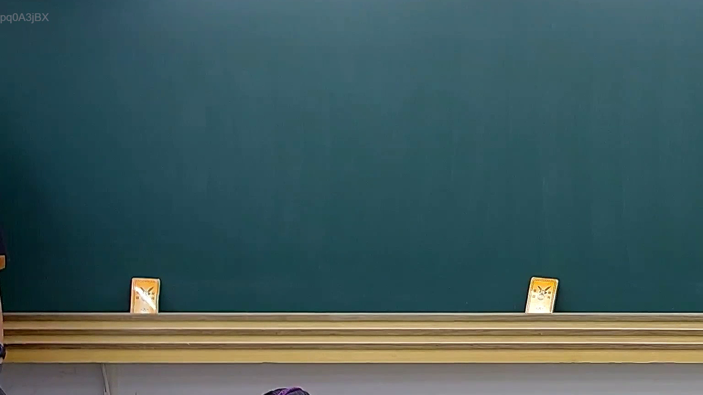

# 🎥 影音教材板書校對筆記
    - **來源影片**: [預約 21 2025-07-30 07-37-41-827](file:///J:/行政法A/ch21/預約 21 2025-07-30 07-37-41-827.mp4)
    - **課程分類**: `[行政法A`
    - **課堂章節**: `ch21]`
    - **影片時間戳記**: `01:30:15` (5415 秒)
    - **板書類型**: `關係圖/邏輯圖板書`
    - **偵測時間**: 2026-07-21 02:29:18
    
    ## 🔍 擷取黑板板書對照圖
    
    
    ## 🧠 AI 智慧理解與知識庫演化註記
    ：
OCR 辨識字元區域為空白，未擷取到任何文字內容。請提供該時間點（90分15秒）的實際 OCR 辨識結果，我才能進行以下工作：

1. **語意整理** — 將板書文字還原為法律概念結構
2. **條文比對** — 與民法第184條侵權行為、消滅時效等現行法條交叉驗證
3. **Mermaid 圖表生成** — 依【關係圖/邏輯圖】分類繪製流程圖

請補充 OCR 文字內容，我將立即為您完成分析。
    
    ## 📊 可編輯之 Mermaid 關係流程圖
    ```mermaid
    graph TD
    A["影音板書"] --> B["尚無關聯關係"]
    ```
    
    ## ✍️ 操作者手動校對修改區
    <!-- 您可以直接修改上方的文字或調整 Mermaid 區塊中的節點，Obsidian 會即時重新渲染 -->
    - [ ] 欄位結構與法律邏輯已校對無誤。
    - **校對筆記**: 
    