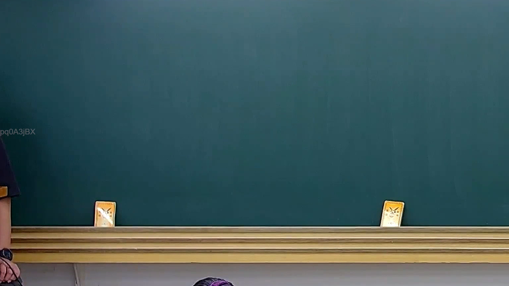

# 🎥 影音教材板書校對筆記
    - **來源影片**: [預約 21 2025-07-30 07-37-41-827](file:///J:/行政法A/ch21/預約 21 2025-07-30 07-37-41-827.mp4)
    - **課程分類**: `[行政法A`
    - **課堂章節**: `ch21]`
    - **影片時間戳記**: `01:33:30` (5610 秒)
    - **板書類型**: `關係圖/邏輯圖板書`
    - **偵測時間**: 2026-07-21 02:30:36
    
    ## 🔍 擷取黑板板書對照圖
    
    
    ## 🧠 AI 智慧理解與知識庫演化註記
    您好！我注意到您的訊息中「擷取區域的 OCR 辨識字元如下：」之後，**實際的 OCR 文字內容似乎沒有貼上**。

請您補充提供該截圖區域的 OCR 辨識結果（例如老師在黑板上所寫的文字、符號或箭頭標註），我才能立即為您完成以下工作：

1. **語意整理與法律條文比對** — 將板書內容與民法第 465-472 條（預約）、第 184 條（侵權行為）、消滅時效等進行對位分析，撰寫「知識庫比對與理解演化註記」。
2. **Mermaid.js 流程圖生成** — 根據板書的邏輯結構（關係圖/邏輯圖或文字板書），輸出完整的 Mermaid 代碼。

請貼上 OCR 文字，我馬上為您處理！
    
    ## 📊 可編輯之 Mermaid 關係流程圖
    ```mermaid
    graph TD
    A["影音板書"] --> B["尚無關聯關係"]
    ```
    
    ## ✍️ 操作者手動校對修改區
    <!-- 您可以直接修改上方的文字或調整 Mermaid 區塊中的節點，Obsidian 會即時重新渲染 -->
    - [ ] 欄位結構與法律邏輯已校對無誤。
    - **校對筆記**: 
    