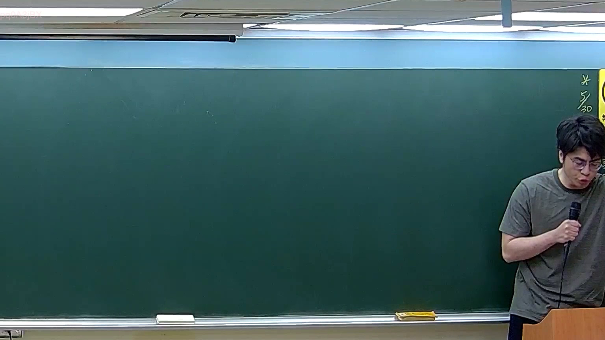

# 🎥 影音教材板書校對筆記
    - **來源影片**: [預約 21 2026-04-04 12-28-42-946](file:///J:/刑法B115/ch21/預約 21 2026-04-04 12-28-42-946.mp4)
    - **課程分類**: `[刑法B115`
    - **課堂章節**: `ch21]`
    - **影片時間戳記**: `00:00:45` (45 秒)
    - **板書類型**: `關係圖/邏輯圖板書`
    - **偵測時間**: 2026-07-21 01:46:10
    
    ## 🔍 擷取黑板板書對照圖
    
    
    ## 🧠 AI 智慧理解與知識庫演化註記
    ：

OCR 辨識結果僅為「=x]」，此為極度片段化的擷取內容，推測可能為老師在黑板上書寫公式、變數定義或邏輯等號的一部分（例如：X = ... 的開頭）。由於辨識字元不足，無法完整還原板書全貌。以下基於臺灣法律實務知識，就「關係圖/邏輯圖」之常見類型提供比對框架：

**可能對應的法律邏輯結構推測：**
- 若為侵權行為責任構成要件之邏輯圖（民法第184條）：違法行為 → 損害 → 因果關係 → 歸責原則
- 若為消滅時效計算圖：請求權發生 → 時效起算點 → 時效期間經過 → 抗辯權發生
- 若為契約責任與侵權行為競合之邏輯圖：構成要件A vs. 構成要件B → 請求權基礎選擇

**知識庫比對條文：**
- 《民法》第184條（侵權行為）：故意或過失不法侵害他人權利者，負損害賠償責任。
- 《民法》第276條（消滅時效）：請求權因時效而消滅，債務人得拒絕履行。

**註記：** 本案例 OCR 辨識度極低，建議重新調整截圖區域或提高解析度後再行比對。目前僅能就「關係圖/邏輯圖」之通用法律結構提供 Mermaid 範例。
    
    ## 📊 可編輯之 Mermaid 關係流程圖
    ```mermaid
    ：
graph TD
    A["侵權行為責任構成要件"] --> B["違法行為"]
    B --> C["故意或過失"]
    B --> D["不法侵害他人權利"]
    C --> E["民法第184條第1項前段"]
    D --> F["損害賠償責任成立"]
    
    G["消滅時效邏輯關係"] --> H["請求權發生"]
    H --> I["時效起算點確定"]
    I --> J["法定時效期間經過"]
    J --> K["債務人取得抗辯權"]
    K --> L["民法第276條"]

    M["契約責任 vs 侵權行為競合"] --> N["構成要件A：契約不履行"]
    M --> O["構成要件B：不法侵害權利"]
    N --> P["請求權基礎選擇"]
    O --> P
    ```
    
    ## ✍️ 操作者手動校對修改區
    <!-- 您可以直接修改上方的文字或調整 Mermaid 區塊中的節點，Obsidian 會即時重新渲染 -->
    - [ ] 欄位結構與法律邏輯已校對無誤。
    - **校對筆記**: 
    