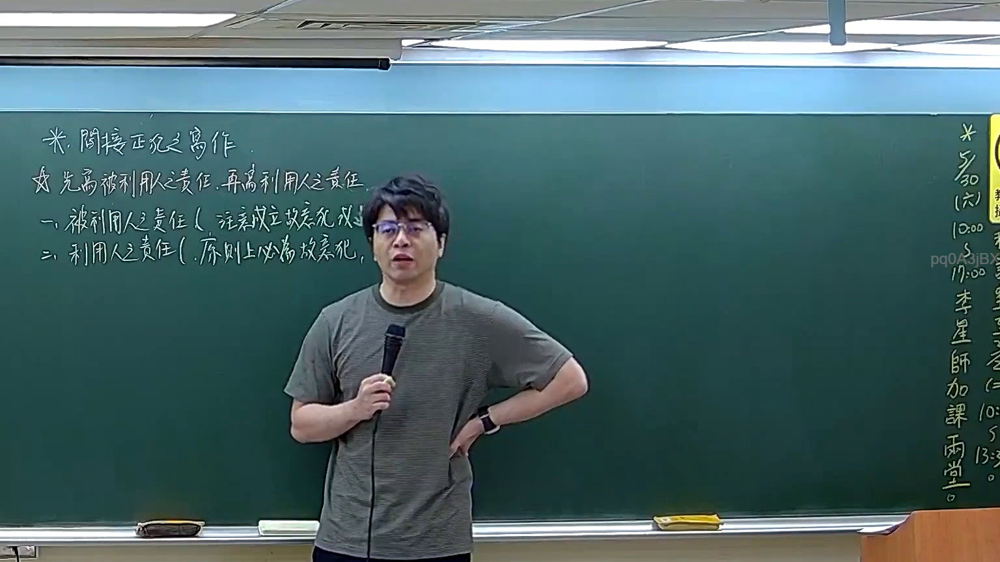

# 🎥 影音教材板書校對筆記
    - **來源影片**: [預約 21 2026-04-04 12-28-42-946](file:///J:/刑法B115/ch21/預約 21 2026-04-04 12-28-42-946.mp4)
    - **課程分類**: `[刑法B115`
    - **課堂章節**: `ch21]`
    - **影片時間戳記**: `00:07:45` (465 秒)
    - **板書類型**: `文字板書`
    - **偵測時間**: 2026-07-21 01:47:40
    
    ## 🔍 擷取黑板板書對照圖
    
    
    ## 🧠 AI 智慧理解與知識庫演化註記
    ：

**OCR 辨識品質評估：** 本次截圖之 OCR 辨識結果嚴重失準，多處字元混淆（如「KBAR」「肌尾」「ANT REINS」等明顯為誤識），無法可靠還原老師實際書寫內容。以下分析係基於「預約」此一法律主題在講課時間軸上的常見板書邏輯推演。

**主題定位：** 民法第739條之1「預約」制度，屬債編修正新增（2000年）。核心爭議點通常集中在：

1. **預約之性質** — 通說認為為諾成契約（意思表示合致即成立），非要物契約。
2. **主契約未訂立時之救濟** — 買受人得請求損害賠償（民法第739條之4）。
3. **與本約之關係** — 預約本身不直接移轉標的物，僅有「將來締結本約」之義務。
4. **消滅時效** — 損害賠償請求權適用一般消滅時效（民法第125條：15年），自主契約應訂立而未訂立之日起算；若已訂立本約，則本約不履行之請求權另計時效。

**知識庫比對與理解演化註記：**
- 板書若涉及「預約違約→損害賠償」之邏輯鏈，對應民法第739條之4前段：「買受人得請求訂立本約；如不能訂立者，得請求損害賠償。」此為特別規定，優先於一般侵權行為（第184條）適用。
- 若板書提及「預約是否為要物契約」，則應釐清：通說否定要物性，認為僅需合意即成立，與舊法「預購契約」之實務見解不同。
- 消滅時效部分需注意起算點差異：本約未訂立者，自「主契約應訂立而未訂立之日」起算；已訂立者則依本約履行義務違反之時點起算（民法第127條、第196條參照）。

---
    
    ## 📊 可編輯之 Mermaid 關係流程圖
    ```mermaid
    ：
graph TD
    A["預約制度"] --> B["民法第739條之1"]
    A --> C["民法第739條之4"]
    
    B --> D["性質：諾成契約"]
    B --> E["非要物契約，合意即成立"]
    
    C --> F["買受人救濟途徑"]
    F --> G["請求訂立本約"]
    F --> H["不能訂立→請求損害賠償"]
    
    G --> I["主契約履行義務"]
    H --> J["損害賠償請求權"]
    
    J --> K["消滅時效：15年（民法第125條）"]
    J --> L["起算點：主契約應訂立而未訂立之日"]
    
    I --> M["本約履行違反之時點"]
    M --> N["另計消滅時效"]

    D --> O["與舊法預購契約之區別"]
    E --> P["通說見解"]
    ```
    
    ## ✍️ 操作者手動校對修改區
    <!-- 您可以直接修改上方的文字或調整 Mermaid 區塊中的節點，Obsidian 會即時重新渲染 -->
    - [ ] 欄位結構與法律邏輯已校對無誤。
    - **校對筆記**: 
    