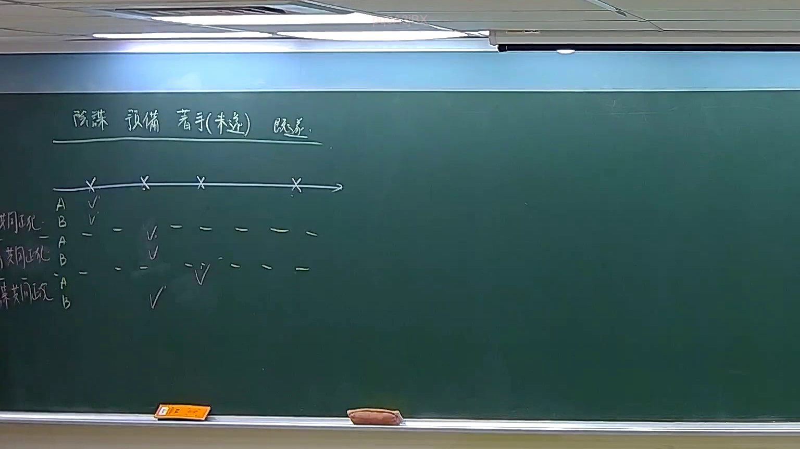

# 🎥 影音教材板書校對筆記
    - **來源影片**: [預約 21 2026-04-04 12-28-42-946](file:///J:/刑法B115/ch21/預約 21 2026-04-04 12-28-42-946.mp4)
    - **課程分類**: `[刑法B115`
    - **課堂章節**: `ch21]`
    - **影片時間戳記**: `00:25:30` (1530 秒)
    - **板書類型**: `關係圖/邏輯圖板書`
    - **偵測時間**: 2026-07-21 01:48:44
    
    ## 🔍 擷取黑板板書對照圖
    
    
    ## 🧠 AI 智慧理解與知識庫演化註記
    ：

⚠️ **OCR 辨識字元為空** — 您提供的擷取區域文字內容未顯示，無法進行語意整理與法律條文比對。請重新提供該截圖的完整 OCR 辨識結果（例如：「民法第184條、故意不法侵害他人權利…」等），我再為您完成以下工作：

1. **知識庫比對與理解演化註記** — 將板書文字與臺灣現行法律條文（如民法第184條侵權行為責任、消滅時效、契約關係等）進行交叉比對，並標註老師的論述重點與法理脈絡。
2. **Mermaid.js 流程圖代碼** — 依板書邏輯結構生成對應的關係圖或邏輯樹（節點文字以雙引號括住）。

---

請將 OCR 辨識字元貼上，我立即為您處理。
    
    ## 📊 可編輯之 Mermaid 關係流程圖
    ```mermaid
    graph TD
    A["影音板書"] --> B["尚無關聯關係"]
    ```
    
    ## ✍️ 操作者手動校對修改區
    <!-- 您可以直接修改上方的文字或調整 Mermaid 區塊中的節點，Obsidian 會即時重新渲染 -->
    - [ ] 欄位結構與法律邏輯已校對無誤。
    - **校對筆記**: 
    