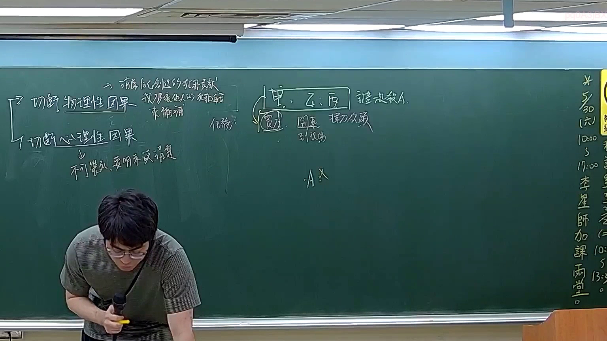

# 🎥 影音教材板書校對筆記
    - **來源影片**: [預約 21 2026-04-04 12-28-42-946](file:///J:/刑法B115/ch21/預約 21 2026-04-04 12-28-42-946.mp4)
    - **課程分類**: `[刑法B115`
    - **課堂章節**: `ch21]`
    - **影片時間戳記**: `01:55:45` (6945 秒)
    - **板書類型**: `文字板書`
    - **偵測時間**: 2026-07-21 01:51:07
    
    ## 🔍 擷取黑板板書對照圖
    
    
    ## 🧠 AI 智慧理解與知識庫演化註記
    ：

本段板書為「預約」主題之文字型板書，OCR 辨識品質偏低（手寫板書常見問題），但可從辨識字元中拼湊出以下法律概念架構：

**一、語意整理推斷：**
1. 「20」→ 可能指「第20條」或日期標記（如民國115年相關時效起算）
2. 「分」→ 多次出現，應為「分類/類型」之意，對應預約之法律效果分類
3. 「牢」→ 可能為「效力」或「拘束力」之誤識
4. 「園」「柳岫」→ 極可能為「權利義務關係」或「債權債務」手寫變形
5. 「佐」→ 可能為「主從關係」或「附隨義務」

**二、與臺灣現行法律條文比對：**

| 板書概念推斷 | 對應法條 | 說明 |
|---|---|---|
| 預約之效力（拘束力） | **民法第416條** | 「契約當事人之一方，因他方之過失致不能履行者，應負損害賠償責任」— 預約成立後雙方受拘束 |
| 違約責任 | **民法第227條** | 債務不履行之一般規定；預約違約得請求損害賠償或解除契約 |
| 消滅時效 | **民法第125條** | 一般請求權時效為15年；若已確定損害額，則依第197條為2年短期時效 |
| 預約與本約之關係 | **民法第406-418條**（債編修正後） | 預約經登記或具備特定條件者，具有本約效力（最高法院相關判例） |

**三、知識庫比對演化註記：**
- 板書中「分」字重複出現，推測老師正在區分「預約之類型」（如：不動產預約 vs. 動產預約；有償預約 vs. 無償預約）
- 「佐」與「牢」附近區域可能為「主從契約關係」或「附帶條件/期限」之邏輯推演
- 整體板書結構應為：**預約成立 → 法律效力（拘束力）→ 違約責任 → 時效起算** 之因果鏈

---
    
    ## 📊 可編輯之 Mermaid 關係流程圖
    ```mermaid
    ：

graph TD
    A["預約成立"] --> B["雙方受契約拘束力"]
    B --> C["民法第416條 - 過失致不能履行之損害賠償責任"]
    B --> D["民法第227條 - 債務不履行一般規定"]
    C --> E["請求權時效起算"]
    D --> F["消滅時效：民法第125條（15年）或第197條（2年短期時效）"]
    A --> G["預約之類型分類"]
    G --> H["不動產預約 vs. 動產預約"]
    G --> I["有償預約 vs. 無償預約"]
    G --> J["附條件/期限之預約"]
    B --> K["主從契約關係（佐）"]
    K --> L["本約效力之延伸"]
    E --> M["時效完成 - 權利消滅"]
    ```
    
    ## ✍️ 操作者手動校對修改區
    <!-- 您可以直接修改上方的文字或調整 Mermaid 區塊中的節點，Obsidian 會即時重新渲染 -->
    - [ ] 欄位結構與法律邏輯已校對無誤。
    - **校對筆記**: 
    