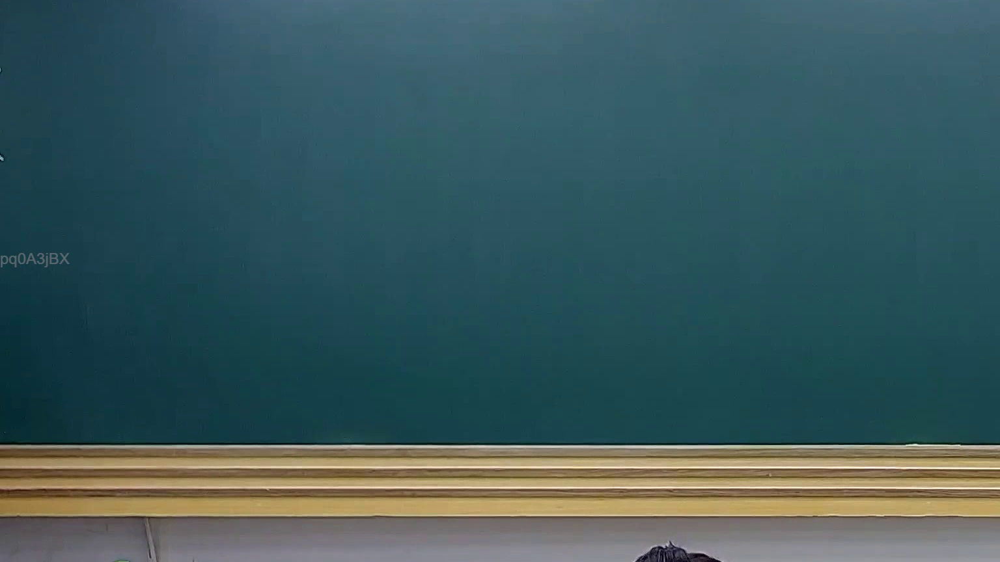

# 🎥 影音教材板書校對筆記
    - **來源影片**: [預約 22 2025-07-30 18-22-54-729](file:///J:/行政法A/ch22/預約 22 2025-07-30 18-22-54-729.mp4)
    - **課程分類**: `[行政法A`
    - **課堂章節**: `ch22]`
    - **影片時間戳記**: `00:03:15` (195 秒)
    - **板書類型**: `關係圖/邏輯圖板書`
    - **偵測時間**: 2026-07-21 03:36:09
    
    ## 🔍 擷取黑板板書對照圖
    
    
    ## 🧠 AI 智慧理解與知識庫演化註記
    ：

您好，您的訊息中「擷取區域的 OCR 辨識字元如下」之後**未附上實際的 OCR 文字內容**。因此我無法進行語意整理、法律條文比對或生成對應的 Mermaid 圖表。

請您補充提供以下任一資訊後，我再為您完成分析：

1. **OCR 辨識出的原始文字**（直接貼上即可）
2. 或 **截圖本身**（若系統支援圖片上傳）

---

一旦收到 OCR 內容，我將依您的要求執行：

- 🔍 **語意整理**：將板書文字歸納為法律概念結構
- ⚖️ **條文比對**：與民法第184條、侵權行為責任、消滅時效等現行法條進行交叉比對，撰寫「知識庫比對與理解演化註記」
- 📊 **Mermaid 圖表生成**：
  - 若為【關係圖/邏輯圖板書】→ 生成對應的 flowchart/graph 結構
  - 若為【文字板書】→ 生成條列式邏輯樹

請補充 OCR 內容，我立刻為您處理。
    
    ## 📊 可編輯之 Mermaid 關係流程圖
    ```mermaid
    graph TD
    A["影音板書"] --> B["尚無關聯關係"]
    ```
    
    ## ✍️ 操作者手動校對修改區
    <!-- 您可以直接修改上方的文字或調整 Mermaid 區塊中的節點，Obsidian 會即時重新渲染 -->
    - [ ] 欄位結構與法律邏輯已校對無誤。
    - **校對筆記**: 
    