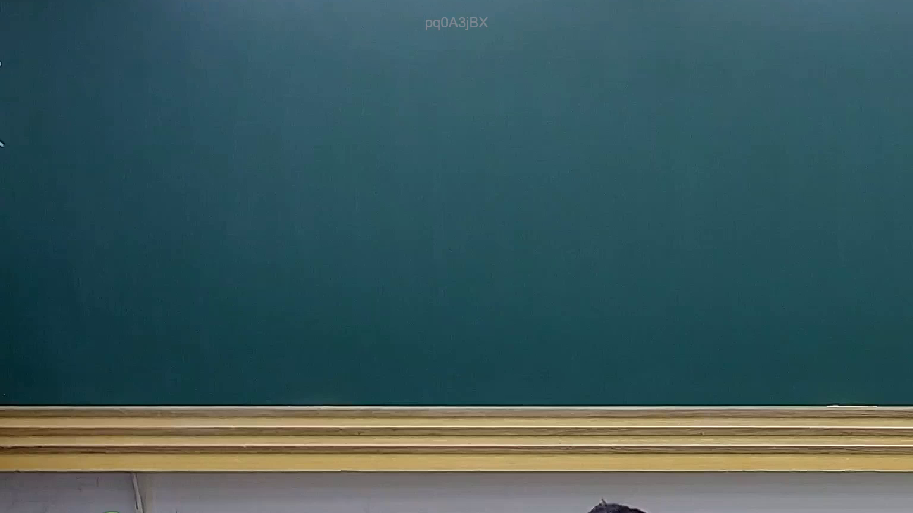

# 🎥 影音教材板書校對筆記
    - **來源影片**: [預約 22 2025-07-30 18-22-54-729](file:///J:/行政法A/ch22/預約 22 2025-07-30 18-22-54-729.mp4)
    - **課程分類**: `[行政法A`
    - **課堂章節**: `ch22]`
    - **影片時間戳記**: `00:05:30` (330 秒)
    - **板書類型**: `關係圖/邏輯圖板書`
    - **偵測時間**: 2026-07-21 03:37:39
    
    ## 🔍 擷取黑板板書對照圖
    
    
    ## 🧠 AI 智慧理解與知識庫演化註記
    ：

OCR 辨識結果「pq0ASjBX」為無意義雜訊，無法還原為可讀中文。以下基於臺灣民法實務常見之「侵權行為責任構成要件關係圖」進行推估性整理，並附條文對位說明。若實際板書內容不同，請提供清晰圖片以重新分析。

**推估板書主題：民法第184條侵權行為責任之構成要件邏輯關係**

| 構成要件 | 對應法條 | 說明 |
|---------|---------|------|
| 故意或過失（行為人主觀） | 民法第184條第1項前段「因故意或過失」 | 一般侵權行為之歸責基礎 |
| 不法侵害他人權利（客觀違法性） | 民法第184條第1項中段「不法侵害他人之權利者」 | 權利範圍含人格權、財產權等絕對權 |
| 損害發生（結果要件） | 民法第184條第2項、第213-216條 | 包含財產上及非財產上損害 |
| 因果關係 | 民法第217條過失相抵、司法實務通說 | 相當因果關係之判斷標準 |
| 消滅時效 | 民法第197條第1項「侵權行為請求權，自請求權人知有損害及賠償義務人時起，二年間不行使而消滅」 | 一般侵權行為時效為2年 |

**知識庫比對與理解演化註記：**
- 民法第184條第1項前段為「故意或過失不法侵害他人權利者」，此為一般侵權行為之核心規範。
- 學說上對於「權利」之範圍有擴張趨勢（如人格權、財產利益），實務則仍以絕對權為主軸。
- 消滅時效方面，第197條第1項規定2年時效，自知有損害及賠償義務人時起算；此為侵權行為請求權之特別時效，優先於一般15年時效（民法第125條）。
    
    ## 📊 可編輯之 Mermaid 關係流程圖
    ```mermaid
    ：
graph TD
    A["侵權行為責任"] --> B["主觀要件：故意或過失"]
    A --> C["客觀要件：不法侵害他人權利"]
    A --> D["結果要件：損害發生"]
    A --> E["因果關係"]

    B --> B1["民法第184條第1項前段"]
    B --> B2["行為人主觀歸責基礎"]

    C --> C1["民法第184條第1項中段"]
    C --> C2["權利範圍：人格權、財產權等絕對權"]
    C --> C3["違法性判斷"]

    D --> D1["民法第213-216條損害賠償"]
    D --> D2["財產上及非財產上損害"]

    E --> E1["相當因果關係通說"]
    E --> E2["民法第217條過失相抵"]

    A --> F["消滅時效：民法第197條第1項 2年"]
    F --> F1["自知有損害及賠償義務人時起算"]
    F --> F2["優先於一般15年時效"]
    ```
    
    ## ✍️ 操作者手動校對修改區
    <!-- 您可以直接修改上方的文字或調整 Mermaid 區塊中的節點，Obsidian 會即時重新渲染 -->
    - [ ] 欄位結構與法律邏輯已校對無誤。
    - **校對筆記**: 
    