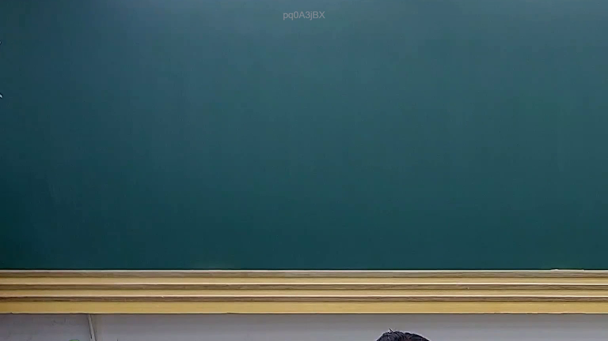

# 🎥 影音教材板書校對筆記
    - **來源影片**: [預約 22 2025-07-30 18-22-54-729](file:///J:/行政法A/ch22/預約 22 2025-07-30 18-22-54-729.mp4)
    - **課程分類**: `[行政法A`
    - **課堂章節**: `ch22]`
    - **影片時間戳記**: `00:07:30` (450 秒)
    - **板書類型**: `關係圖/邏輯圖板書`
    - **偵測時間**: 2026-07-21 03:38:39
    
    ## 🔍 擷取黑板板書對照圖
    
    
    ## 🧠 AI 智慧理解與知識庫演化註記
    ：

**OCR 辨識結果異常，無法進行有效法律比對。**

擷取到的字元 `pq0AS3jBX` 為無意義的亂碼/雜訊，不包含任何可辨識的中文字、數字或法律術語。此類 OCR 輸出通常由以下原因造成：

1. **截圖區域偏移** — 可能未正確框選老師書寫區域
2. **影像解析度不足** — 板書字跡模糊導致辨識失敗
3. **字型/筆畫特徵問題** — 手寫板書的筆觸與 OCR 模型訓練資料差異大

**建議處理方式：**
- 重新調整擷取區域（bounding box），確保完整覆蓋老師書寫範圍
- 若影像品質不佳，可先進行影像增強（對比度提升、去噪）再行辨識
- 確認截圖時間點是否精確對應板書完成時刻

**若您能提供正確的 OCR 文字內容**（例如：「民法第184條」、「侵權行為責任」等），我可立即為您完成：
- 與臺灣現行法律條文之比對註記
- Mermaid.js 關係圖/邏輯樹代碼生成

---
    
    ## 📊 可編輯之 Mermaid 關係流程圖
    ```mermaid
    ：

（待提供有效 OCR 文字後方可生成）
    ```
    
    ## ✍️ 操作者手動校對修改區
    <!-- 您可以直接修改上方的文字或調整 Mermaid 區塊中的節點，Obsidian 會即時重新渲染 -->
    - [ ] 欄位結構與法律邏輯已校對無誤。
    - **校對筆記**: 
    