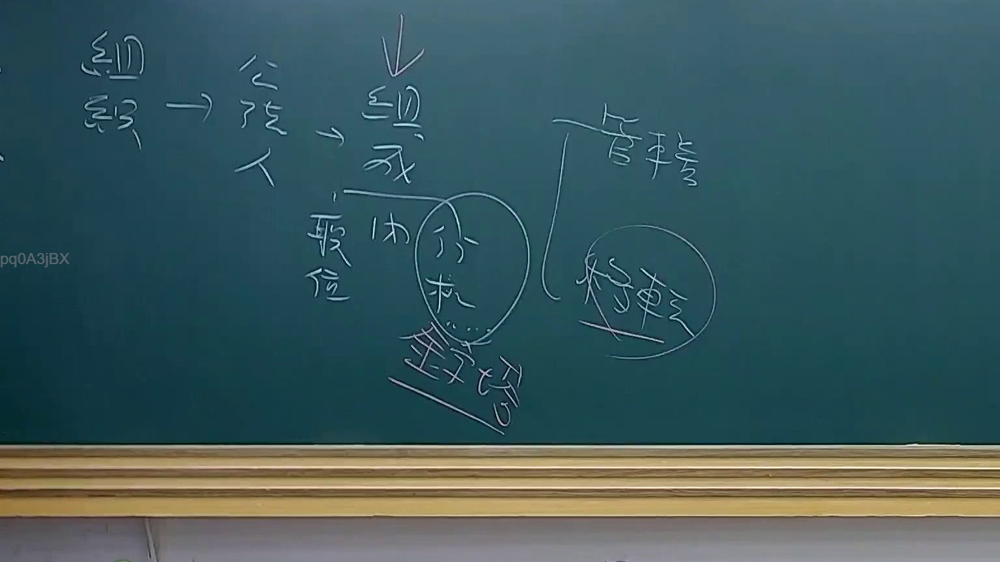

# 🎥 影音教材板書校對筆記
    - **來源影片**: [預約 22 2025-07-30 18-22-54-729](file:///J:/行政法A/ch22/預約 22 2025-07-30 18-22-54-729.mp4)
    - **課程分類**: `[行政法A`
    - **課堂章節**: `ch22]`
    - **影片時間戳記**: `00:10:00` (600 秒)
    - **板書類型**: `關係圖/邏輯圖板書`
    - **偵測時間**: 2026-07-21 03:39:45
    
    ## 🔍 擷取黑板板書對照圖
    
    
    ## 🧠 AI 智慧理解與知識庫演化註記
    ：

您好，我注意到您提供的「擷取區域的 OCR 辨識字元」內容為空白（未顯示任何文字）。由於缺乏實際的板書文字資料，我無法進行以下工作：

1. **語意整理** — 無文字可分析
2. **與臺灣現行法律條文比對**（如民法第184條侵權行為、消滅時效等）— 無內容可對位
3. **生成 Mermaid.js 流程圖** — 無法建立邏輯結構

---

**請您協助提供以下任一方式：**

- 📋 **直接貼上 OCR 辨識出的文字內容**（即使有錯字或斷行，我也能修正）
- 🖼️ **重新上傳截圖**，我可以嘗試自行進行 OCR 辨識
- ✍️ **手動輸入板書上的關鍵文字**，例如老師寫下的法律概念、條文編號、關係詞等

一旦我拿到實際內容，我會立即為您完成：
- 語意整理與法律條文比對註記
- Mermaid.js 流程圖代碼生成（含雙引號包裹節點）

期待您的補充資料！
    
    ## 📊 可編輯之 Mermaid 關係流程圖
    ```mermaid
    graph TD
    A["影音板書"] --> B["尚無關聯關係"]
    ```
    
    ## ✍️ 操作者手動校對修改區
    <!-- 您可以直接修改上方的文字或調整 Mermaid 區塊中的節點，Obsidian 會即時重新渲染 -->
    - [ ] 欄位結構與法律邏輯已校對無誤。
    - **校對筆記**: 
    