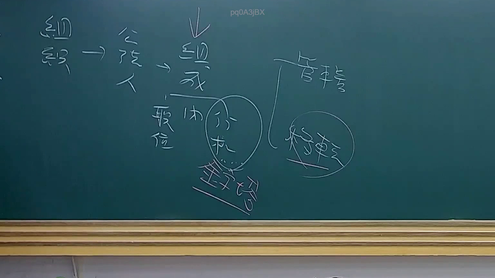

# 🎥 影音教材板書校對筆記
    - **來源影片**: [預約 22 2025-07-30 18-22-54-729](file:///J:/行政法A/ch22/預約 22 2025-07-30 18-22-54-729.mp4)
    - **課程分類**: `[行政法A`
    - **課堂章節**: `ch22]`
    - **影片時間戳記**: `00:12:30` (750 秒)
    - **板書類型**: `關係圖/邏輯圖板書`
    - **偵測時間**: 2026-07-21 03:41:34
    
    ## 🔍 擷取黑板板書對照圖
    
    
    ## 🧠 AI 智慧理解與知識庫演化註記
    您好！我注意到您的訊息中「擷取區域的 OCR 辨識字元如下：」之後，**實際的文字內容似乎沒有成功附上**。目前訊息裡只有空白空間，無法辨識出任何板書文字。

為了協助您完成以下任務，請您重新提供 OCR 辨識出的文字內容：

1. **語意整理與法律條文比對註記**（民法第184條、侵權行為、消滅時效等）
2. **Mermaid.js 流程圖代碼生成**（關係圖/邏輯圖結構）

---

請將 OCR 文字貼上後，我即可立即為您：
- 🔍 比對臺灣現行法律條文與實務見解
- 📝 撰寫知識庫比對與理解演化註記
- 🌳 生成對應的 Mermaid 關係圖代碼（含雙引號格式）

期待您的補充！
    
    ## 📊 可編輯之 Mermaid 關係流程圖
    ```mermaid
    graph TD
    A["影音板書"] --> B["尚無關聯關係"]
    ```
    
    ## ✍️ 操作者手動校對修改區
    <!-- 您可以直接修改上方的文字或調整 Mermaid 區塊中的節點，Obsidian 會即時重新渲染 -->
    - [ ] 欄位結構與法律邏輯已校對無誤。
    - **校對筆記**: 
    