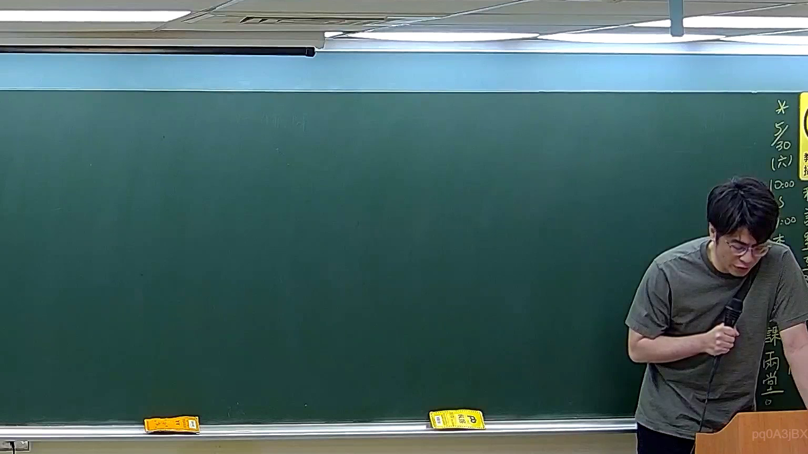

# 🎥 影音教材板書校對筆記
    - **來源影片**: [預約 22 2026-04-04 16-06-56-414](file:///J:/刑法B115/ch22/預約 22 2026-04-04 16-06-56-414.mp4)
    - **課程分類**: `[刑法B115`
    - **課堂章節**: `ch22]`
    - **影片時間戳記**: `00:00:45` (45 秒)
    - **板書類型**: `關係圖/邏輯圖板書`
    - **偵測時間**: 2026-07-21 01:48:14
    
    ## 🔍 擷取黑板板書對照圖
    
    
    ## 🧠 AI 智慧理解與知識庫演化註記
    ：

您好，您提供的提示中「擷取區域的 OCR 辨識字元如下」之後**未附實際文字內容**。因此我無法對板書進行語意整理、條文比對或生成 Mermaid 圖表。

請將 OCR 辨識出的文字貼上後，我會立即為您完成以下工作：

1. **語意整理與法律條文比對** — 針對板書內容，自動對位臺灣現行法條（如民法第184條侵權行為、消滅時效等），並撰寫「知識庫比對與理解演化註記」。
2. **Mermaid.js 流程圖生成** — 依板書邏輯結構，輸出完整的 Mermaid 代碼（節點文字以雙引號括住）。

請補充 OCR 辨識字元，我即刻為您處理。
    
    ## 📊 可編輯之 Mermaid 關係流程圖
    ```mermaid
    graph TD
    A["影音板書"] --> B["尚無關聯關係"]
    ```
    
    ## ✍️ 操作者手動校對修改區
    <!-- 您可以直接修改上方的文字或調整 Mermaid 區塊中的節點，Obsidian 會即時重新渲染 -->
    - [ ] 欄位結構與法律邏輯已校對無誤。
    - **校對筆記**: 
    