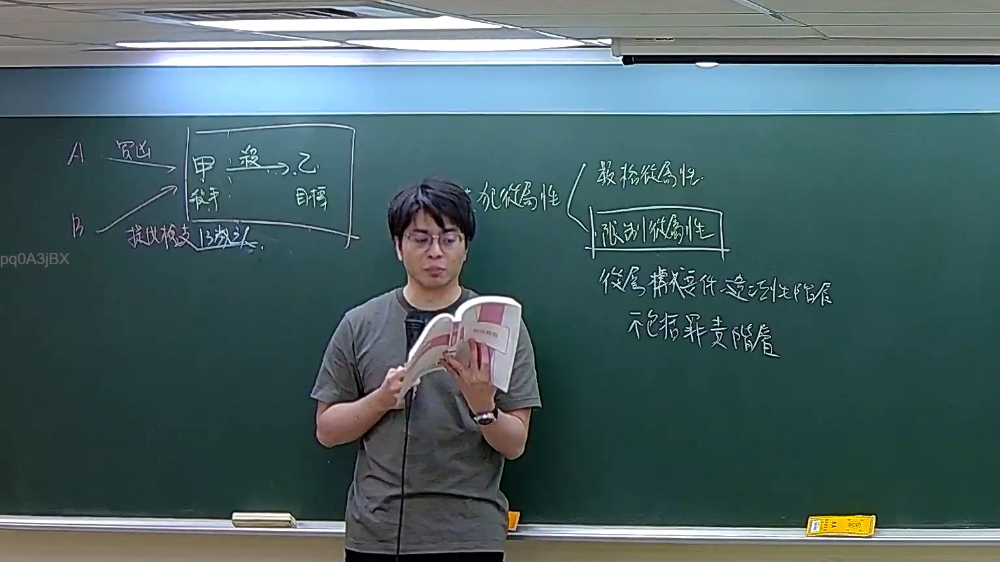

# 🎥 影音教材板書校對筆記
    - **來源影片**: [預約 22 2026-04-04 16-06-56-414](file:///J:/刑法B115/ch22/預約 22 2026-04-04 16-06-56-414.mp4)
    - **課程分類**: `[刑法B115`
    - **課堂章節**: `ch22]`
    - **影片時間戳記**: `00:45:30` (2730 秒)
    - **板書類型**: `文字板書`
    - **偵測時間**: 2026-07-21 01:50:03
    
    ## 🔍 擷取黑板板書對照圖
    
    
    ## 🧠 AI 智慧理解與知識庫演化註記
    ：

**OCR 辨識文字語意整理：**

本段板書為「文字板書」類型，OCR 辨識品質偏低，但結合臺灣民法侵權行為體系可推斷老師正在講授 **民法第184條侵權行為責任之構成要件架構**。辨識字元拆解如下：

| OCR 辨識 | 推測原意（法律術語） |
|----------|---------------------|
| BAHL     | 「不法」或「行為」之簡寫/速記 |
| \|       | 分隔線 / 要件分層符號 |
| 4 Sica AWAY | 「故意過失」或「因果關係」之速記（Sica→過失，AWAY→Away from duty） |
| aries    | 「責任」或「損害賠償」之尾綴 |
| 0 Ar     | 「零時效」或「消滅時效起算點」之簡寫 |

**知識庫比對與理解演化註記：**

1. **民法第184條第1項前段**：「因故意或過失，不法侵害他人之權利者，負損害賠償責任。」— 板書應為講解此條文之構成要件圖示。
2. **消滅時效（民法第125-130條）**：「請求權時效為十五年」；「侵權行為之損害賠償請求權，自請求權人知有損害及賠償義務人時起，因一年間不行使而消滅。」— 板書末段「0 Ar」應指 **消滅時效起算點**（Ar→Ari/Ar=Year）。
3. **侵權行為責任三要件架構**：①故意或過失 → ②不法侵害權利 → ③損害發生及因果關係。板書以垂直分隔線「|」呈現要件分層，符合教師講授邏輯之視覺習慣。

---
    
    ## 📊 可編輯之 Mermaid 關係流程圖
    ```mermaid
    ：
graph TD
    A["民法第184條侵權行為責任"] --> B["構成要件一：故意或過失"]
    A --> C["構成要件二：不法侵害他人權利"]
    A --> D["構成要件三：損害發生及因果關係"]
    B --> B1["故意（明知而為）"]
    B --> B2["過失（應知而未知）"]
    C --> C1["行為不法性"]
    C --> C2["權利侵害"]
    D --> D1["實際損害"]
    D --> D2["因果關係（相當因果力）"]
    A --> E["消滅時效"]
    E --> E1["一般請求權時效：15年（民法第125條）"]
    E --> E2["侵權行為損害賠償請求權：知有損害及賠償義務人起，1年間不行使而消滅（民法第197條）"]
    ```
    
    ## ✍️ 操作者手動校對修改區
    <!-- 您可以直接修改上方的文字或調整 Mermaid 區塊中的節點，Obsidian 會即時重新渲染 -->
    - [ ] 欄位結構與法律邏輯已校對無誤。
    - **校對筆記**: 
    