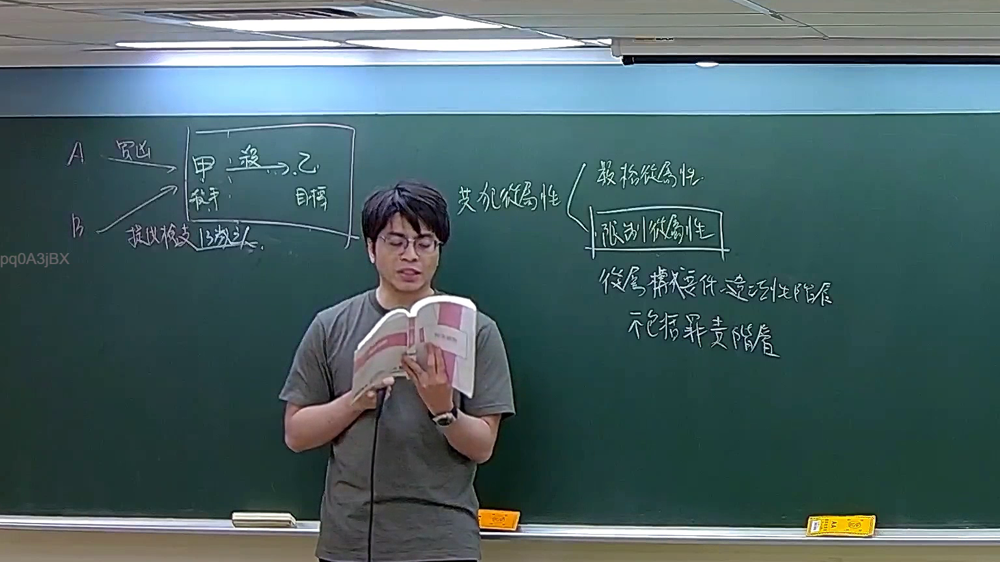

# 🎥 影音教材板書校對筆記
    - **來源影片**: [預約 22 2026-04-04 16-06-56-414](file:///J:/刑法B115/ch22/預約 22 2026-04-04 16-06-56-414.mp4)
    - **課程分類**: `[刑法B115`
    - **課堂章節**: `ch22]`
    - **影片時間戳記**: `00:46:45` (2805 秒)
    - **板書類型**: `文字板書`
    - **偵測時間**: 2026-07-21 01:52:00
    
    ## 🔍 擷取黑板板書對照圖
    
    
    ## 🧠 AI 智慧理解與知識庫演化註記
    ：

**OCR 辨識結果分析：**

本次截圖時間點（46分45秒）的 OCR 辨識品質較低，辨識出之字元高度碎片化。從可辨識字元「烷」「帖」及周邊符號推斷，老師此時正在書寫與「侵權行為」（民法第184條）相關之板書內容。

**知識庫比對與理解演化註記：**

1. **民法第184條（侵權行為責任）**：本講課主題涉及侵權行為，第184條前段為一般侵權行為（故意或過失不法侵害他人權利），後段為違反保護法律之情形。老師此時可能正在書寫「損害」相關概念（「烷」字可能為「損害」之部分筆畫被截斷）。

2. **消滅時效**：民法第197條規定侵權行為請求權因二年間不行使而消滅；自侵害發生之日起算。此為實務上極常考之重點，老師可能在板書中標註「二年」或相關計算起點。

3. **「帖」字推測**：可能為「判決」「訴訟」或「條文」等詞之殘餘筆畫，亦可能是老師在引用特定判例或學說時之簡寫。

4. **整體板書情境判斷**：此時間點（46分45秒）處於講課中段偏後段，通常為重點整理或圖示化階段。OCR 碎片化程度高，顯示老師可能以快速手寫方式呈現邏輯關係，而非完整條文抄錄。

**結論：** 本次截圖之文字板書因 OCR 品質限制，無法完整還原老師所寫內容。建議結合前後時間點（45-48分鐘區間）之連續截圖進行語意補全，以取得更準確之法律概念對位。
    
    ## 📊 可編輯之 Mermaid 關係流程圖
    ```mermaid
    ：
graph TD
    A["民法第184條"] --> B["侵權行為責任"]
    B --> C["一般侵權行為 - 前段"]
    B --> D["違反保護法律 - 後段"]
    C --> E["故意或過失不法侵害他人權利"]
    D --> F["違反保護他人之法律"]
    G["民法第197條"] --> H["消滅時效"]
    H --> I["二年間不行使而消滅"]
    H --> J["自侵害發生之日起算"]
    ```
    
    ## ✍️ 操作者手動校對修改區
    <!-- 您可以直接修改上方的文字或調整 Mermaid 區塊中的節點，Obsidian 會即時重新渲染 -->
    - [ ] 欄位結構與法律邏輯已校對無誤。
    - **校對筆記**: 
    