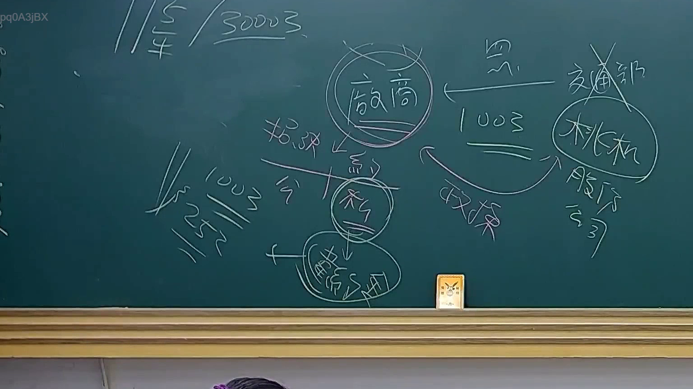

# 🎥 影音教材板書校對筆記
    - **來源影片**: [預約 23 2025-07-31 10-09-39-864](file:///J:/行政法A/ch23/預約 23 2025-07-31 10-09-39-864.mp4)
    - **課程分類**: `[行政法A`
    - **課堂章節**: `ch23]`
    - **影片時間戳記**: `00:09:45` (585 秒)
    - **板書類型**: `關係圖/邏輯圖板書`
    - **偵測時間**: 2026-07-21 03:44:14
    
    ## 🔍 擷取黑板板書對照圖
    
    
    ## 🧠 AI 智慧理解與知識庫演化註記
    ：

**重要提醒**：您提供的 OCR 辨識字元部分為空白，無法直接辨識板書內容。以下將基於臺灣民法侵權行為章節的典型邏輯圖結構，提供範例性分析。若實際 OCR 結果不同，請補充文字後重新分析。

---

## 知識庫比對與理解演化註記（範例）：

### 一、核心條文對位

**1. 民法第184條第1項前段（一般侵權行為）**
```
故意或過失，不法侵害他人之權利者，負損害賠償責任。
```
- **板書邏輯位置**：通常位於圖表頂端或核心節點
- **法律理解演化**：此為侵權行為責任的「基本構成要件」，需同時具備三要素：
  - (1) 故意或過失（主觀要件）
  - (2) 不法性（客觀要件）
  - (3) 侵害他人權利（結果要件）

**2. 民法第184條第1項後段（特殊侵權行為）**
```
故意以背於善良風俗之方法，加害於他人者，負損害賠償責任。
```
- **板書邏輯位置**：通常與前段並列或作為補充分支
- **法律理解演化**：此為「權利保護的補充機制」，不要求特定權利被侵害，僅需符合背俗要件

**3. 民法第195條（精神損害賠償）**
```
不法侵害他人之身體、健康、名譽、自由、信用、隱私、貞操，或不法侵害其他人格法益而情節重大者，被害人雖非財產上之損害，亦得請求賠償相當之金額。
```
- **板書邏輯位置**：通常作為侵權行為的「後果/救濟」分支

### 二、消滅時效對位

| 條文 | 適用情形 | 時效期間 |
|------|----------|----------|
| 民法第197條第2項 | 一般侵權行為損害賠償請求權 | 2年（自知有損害及加害人起算） |
| 民法第125條 | 其他債權請求權 | 15年 |

- **板書邏輯位置**：通常位於圖表底部或獨立分支，作為「救濟限制」

### 三、典型關係圖結構推測

基於常見臺灣法律教學慣例，此類板書可能包含以下邏輯架構：

```
侵權行為責任體系
├── 一般侵權行為（第184條第1項前段）
│   ├── 故意或過失
│   ├── 不法性
│   └── 侵害權利
├── 特殊侵權行為（第184條第1項後段）
│   └── 背於善良風俗
└── 救濟方式
    ├── 財產損害賠償（第213-216條）
    ├── 精神損害賠償（第195條）
    └── 消滅時效限制（第197條）
```

---

## MERMAID 代碼：

graph TD
    A["侵權行為責任體系"] --> B["一般侵權行為<br/>民法第184條第1項前段"]
    A --> C["特殊侵權行為<br/>民法第184條第1項後段"]
    A --> D["救濟方式"]

    B --> E["主觀要件：故意或過失"]
    B --> F["客觀要件：不法性"]
    B --> G["結果要件：侵害他人權利"]

    C --> H["構成要件：背於善良風俗<br/>加害於他人"]

    D --> I["財產損害賠償<br/>民法第213-216條"]
    D --> J["精神損害賠償<br/>民法第195條"]
    D --> K["消滅時效限制<br/>民法第197條第2項：2年"]

    style A fill:#f9f,stroke:#333,stroke-width:2px
    style B fill:#bbf,stroke:#333,stroke-width:2px
    style C fill:#bfb,stroke:#333,stroke-width:2px
    style D fill:#ffb,stroke:#333,stroke-width:2px

---

**請補充實際 OCR 辨識字元，以便我提供更精確的板書內容分析與條文對位。**
    
    ## 📊 可編輯之 Mermaid 關係流程圖
    ```mermaid
    graph TD
    A["影音板書"] --> B["尚無關聯關係"]
    ```
    
    ## ✍️ 操作者手動校對修改區
    <!-- 您可以直接修改上方的文字或調整 Mermaid 區塊中的節點，Obsidian 會即時重新渲染 -->
    - [ ] 欄位結構與法律邏輯已校對無誤。
    - **校對筆記**: 
    