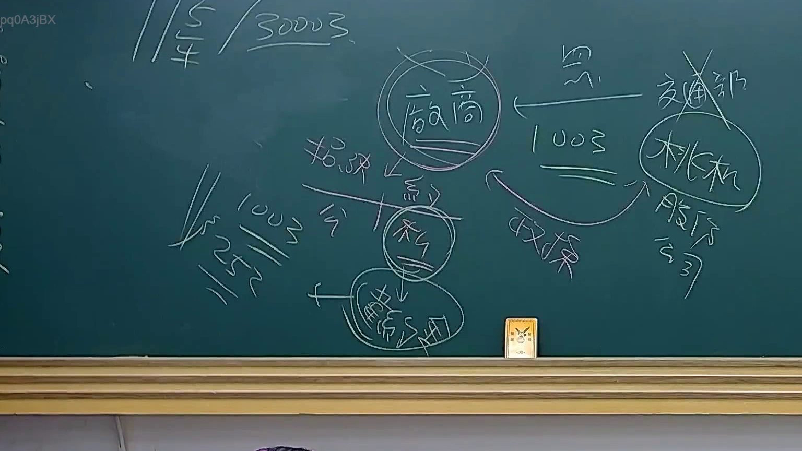

# 🎥 影音教材板書校對筆記
    - **來源影片**: [預約 23 2025-07-31 10-09-39-864](file:///J:/行政法A/ch23/預約 23 2025-07-31 10-09-39-864.mp4)
    - **課程分類**: `[行政法A`
    - **課堂章節**: `ch23]`
    - **影片時間戳記**: `00:10:45` (645 秒)
    - **板書類型**: `關係圖/邏輯圖板書`
    - **偵測時間**: 2026-07-21 03:45:15
    
    ## 🔍 擷取黑板板書對照圖
    
    
    ## 🧠 AI 智慧理解與知識庫演化註記
    ：

您好，我注意到您提供的訊息中「擷取區域的 OCR 辨識字元」部分為空白，未實際顯示任何文字內容。因此我無法針對具體板書文字進行語意整理、法律條文比對及 Mermaid 代碼生成。

請您補充以下資訊後，我再為您完成完整分析：

1. **OCR 辨識出的板書文字**（請貼上完整字串）
2. （如有需要）老師當時講解的具體情境或案例背景

---

一旦您提供 OCR 文字，我將立即執行以下工作：

- 🔍 **語意整理**：拆解板書邏輯結構、法律概念關聯
- 📚 **條文比對**：與民法第184條（侵權行為）、消滅時效等現行法條進行交叉驗證
- 🌳 **Mermaid 代碼生成**：依「關係圖/邏輯圖」或「文字板書」分類，輸出對應的 Mermaid.js 流程圖

請貼上 OCR 文字，我隨時待命！
    
    ## 📊 可編輯之 Mermaid 關係流程圖
    ```mermaid
    graph TD
    A["影音板書"] --> B["尚無關聯關係"]
    ```
    
    ## ✍️ 操作者手動校對修改區
    <!-- 您可以直接修改上方的文字或調整 Mermaid 區塊中的節點，Obsidian 會即時重新渲染 -->
    - [ ] 欄位結構與法律邏輯已校對無誤。
    - **校對筆記**: 
    