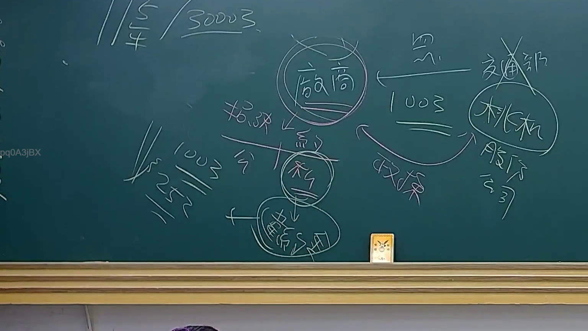

# 🎥 影音教材板書校對筆記
    - **來源影片**: [預約 23 2025-07-31 10-09-39-864](file:///J:/行政法A/ch23/預約 23 2025-07-31 10-09-39-864.mp4)
    - **課程分類**: `[行政法A`
    - **課堂章節**: `ch23]`
    - **影片時間戳記**: `00:11:30` (690 秒)
    - **板書類型**: `關係圖/邏輯圖板書`
    - **偵測時間**: 2026-07-21 03:46:08
    
    ## 🔍 擷取黑板板書對照圖
    
    
    ## 🧠 AI 智慧理解與知識庫演化註記
    ：

您好！我注意到您的訊息中「擷取區域的 OCR 辨識字元如下：」之後，實際的文字內容似乎沒有被正確傳遞過來（顯示為空白）。因此我無法對板書文字進行語意整理、法律條文比對或生成 Mermaid 代碼。

請您重新提供以下資訊，我即可立即協助：

1. **OCR 辨識出的具體字元**（例如：「民法第184條」等）
2. （可選）**板書的視覺結構描述**（若為關係圖/邏輯圖，說明各節點與箭頭方向）

一旦收到文字內容，我將立即為您完成：
- 語意整理與臺灣現行法律條文比對註記
- Mermaid.js 流程圖代碼生成

請補充 OCR 字元後再發一次訊息即可。
    
    ## 📊 可編輯之 Mermaid 關係流程圖
    ```mermaid
    graph TD
    A["影音板書"] --> B["尚無關聯關係"]
    ```
    
    ## ✍️ 操作者手動校對修改區
    <!-- 您可以直接修改上方的文字或調整 Mermaid 區塊中的節點，Obsidian 會即時重新渲染 -->
    - [ ] 欄位結構與法律邏輯已校對無誤。
    - **校對筆記**: 
    