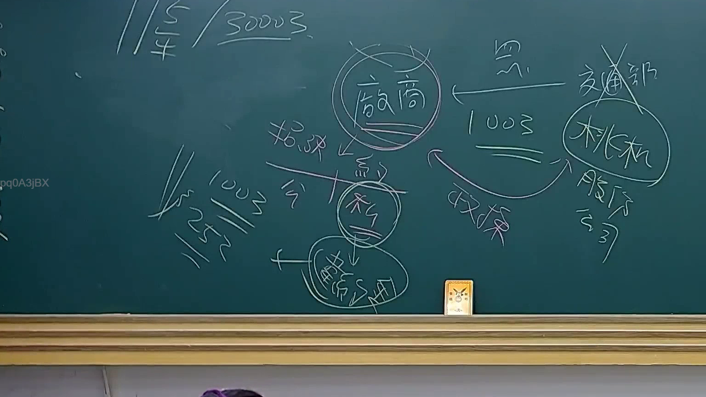

# 🎥 影音教材板書校對筆記
    - **來源影片**: [預約 23 2025-07-31 10-09-39-864](file:///J:/行政法A/ch23/預約 23 2025-07-31 10-09-39-864.mp4)
    - **課程分類**: `[行政法A`
    - **課堂章節**: `ch23]`
    - **影片時間戳記**: `00:13:30` (810 秒)
    - **板書類型**: `關係圖/邏輯圖板書`
    - **偵測時間**: 2026-07-21 03:46:58
    
    ## 🔍 擷取黑板板書對照圖
    
    
    ## 🧠 AI 智慧理解與知識庫演化註記
    您好！我注意到您的訊息中「擷取區域的 OCR 辨識字元」部分似乎是空的（在「如下：」之後沒有具體文字內容）。

為了能正確完成以下任務，我需要您提供：

1. **OCR 辨識出的板書文字** — 請貼上老師在黑板上所寫的內容
2. **如有圖片截圖** — 若有該時間點的截圖檔案，也可以一併提供給我分析

一旦收到這些資訊，我將立即為您完成：

- ：語意整理 + 與民法第184條、侵權行為、消滅時效等條文的比對註記
-
    
    ## 📊 可編輯之 Mermaid 關係流程圖
    ```mermaid
    ：對應的 Mermaid.js 流程圖（節點用雙引號括住）

請補充 OCR 文字內容，我隨時準備好為您分析！
    ```
    
    ## ✍️ 操作者手動校對修改區
    <!-- 您可以直接修改上方的文字或調整 Mermaid 區塊中的節點，Obsidian 會即時重新渲染 -->
    - [ ] 欄位結構與法律邏輯已校對無誤。
    - **校對筆記**: 
    