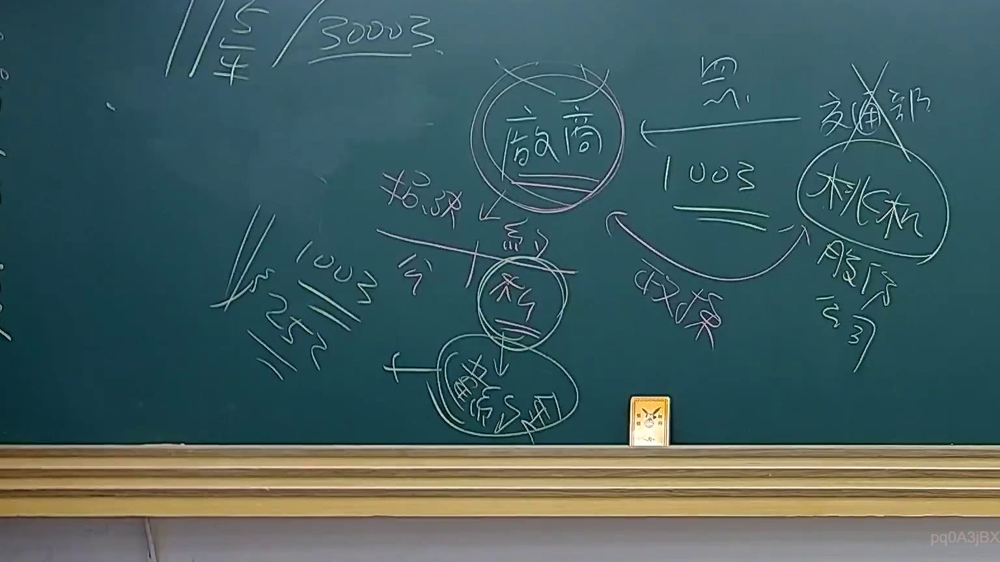

# 🎥 影音教材板書校對筆記
    - **來源影片**: [預約 23 2025-07-31 10-09-39-864](file:///J:/行政法A/ch23/預約 23 2025-07-31 10-09-39-864.mp4)
    - **課程分類**: `[行政法A`
    - **課堂章節**: `ch23]`
    - **影片時間戳記**: `00:18:15` (1095 秒)
    - **板書類型**: `關係圖/邏輯圖板書`
    - **偵測時間**: 2026-07-21 03:47:55
    
    ## 🔍 擷取黑板板書對照圖
    
    
    ## 🧠 AI 智慧理解與知識庫演化註記
    您好！我注意到您的訊息中「擷取區域的 OCR 辨識字元如下：」之後，**實際的文字內容似乎沒有被成功傳遞過來**（顯示為空白）。

為了協助您完成以下兩項任務：

1. **語意整理與法律條文比對註記**
2. **Mermaid.js 流程圖代碼生成**

我需要您提供該截圖區域的 OCR 辨識文字。請將板書上的文字內容貼上，例如：

> 「民法第184條、侵權行為、消滅時效……」

一旦收到文字，我將立即為您完成：
- 📖 **知識庫比對與理解演化註記**（對照現行臺灣法律條文）
- 🌳 **Mermaid 關係圖/邏輯樹代碼**（節點用雙引號括住，符合語法規範）

請補充 OCR 文字內容，我隨時待命！
    
    ## 📊 可編輯之 Mermaid 關係流程圖
    ```mermaid
    graph TD
    A["影音板書"] --> B["尚無關聯關係"]
    ```
    
    ## ✍️ 操作者手動校對修改區
    <!-- 您可以直接修改上方的文字或調整 Mermaid 區塊中的節點，Obsidian 會即時重新渲染 -->
    - [ ] 欄位結構與法律邏輯已校對無誤。
    - **校對筆記**: 
    