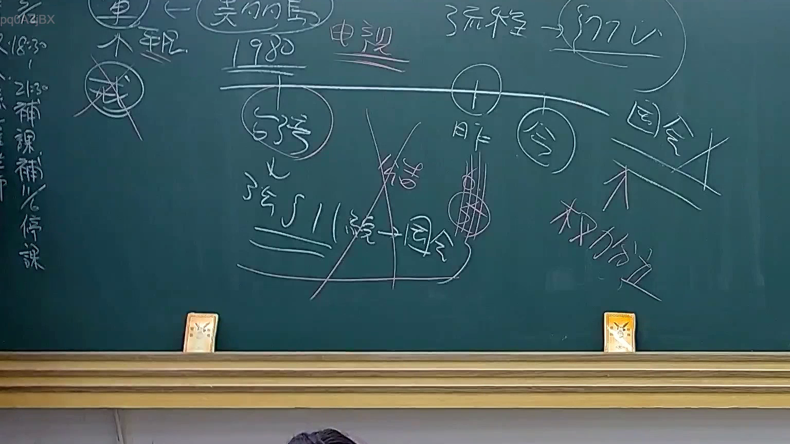

# 🎥 影音教材板書校對筆記
    - **來源影片**: [預約 24 2025-07-31 15-33-47-467](file:///J:/行政法A/ch24/預約 24 2025-07-31 15-33-47-467.mp4)
    - **課程分類**: `[行政法A`
    - **課堂章節**: `ch24]`
    - **影片時間戳記**: `00:09:45` (585 秒)
    - **板書類型**: `影音板書`
    - **偵測時間**: 2026-07-22 03:40:55
    
    ## 🔍 擷取黑板板書對照圖
    
    
    ## 🧠 AI 智慧理解與知識庫演化註記
    ：
此板書主要在探討行政法或憲法層級中，法律制度的時序演變與權力歸屬問題。

1. **文字辨識內容**：
   - 頂部：標註「美的馬」、「電視」、「流程 -> 流程」。
   - 時間軸：以「1980」為基準，區分為「昨」與「今」。
   - 核心關係：將「345/1（釋字第345號解釋）」與「因令（命令）」連結；同時出現「國會」與「權力位」的對應關係。
   - 符號意義：打叉符號代表該概念在特定時間點或邏輯下已被否定或廢止。

2. **法律學理與註記**：
   - **釋字第345號解釋**：這是板書的核心。該號解釋涉及「公務人員保險法」及其相關法規，重點在於探討法律保留原則與授權命令的界線。
   - **時序邏輯**：老師利用「昨」與「今」區分舊法體系與新法體系，特別強調在「權力位」（權力分立）的架構下，國會立法權與行政機關發布命令之關聯。
   - **法律對照**：
     - **中央法規標準法第5條、第6條**：關於法律保留事項，涉及人民權利義務者應以法律定之，不得僅以「因令」（行政命令）規範。
     - **憲法位階理論**：板書中「因令 -> 國會」被畫上刪除線，暗示行政命令若涉及應由法律規範事項，在權力分立下已不被容許，應回歸「國會」立法。
    
    ## 📊 可編輯之 Mermaid 關係流程圖
    ```mermaid
    ：
graph TD
    A["1980年時間軸"] --> B["昨 舊法體系"]
    A --> C["今 現行法體系"]
    B --> D["釋字第345號"]
    D --> E["因令/行政命令"]
    E -.->|否定/違憲| F["國會立法權"]
    C --> G["權力位/權力分立"]
    G --> H["國會"]
    H --> I["法律保留"]
    ```
    
    ## ✍️ 操作者手動校對修改區
    <!-- 您可以直接修改上方的文字或調整 Mermaid 區塊中的節點，Obsidian 會即時重新渲染 -->
    - [ ] 欄位結構與法律邏輯已校對無誤。
    - **校對筆記**: 
    