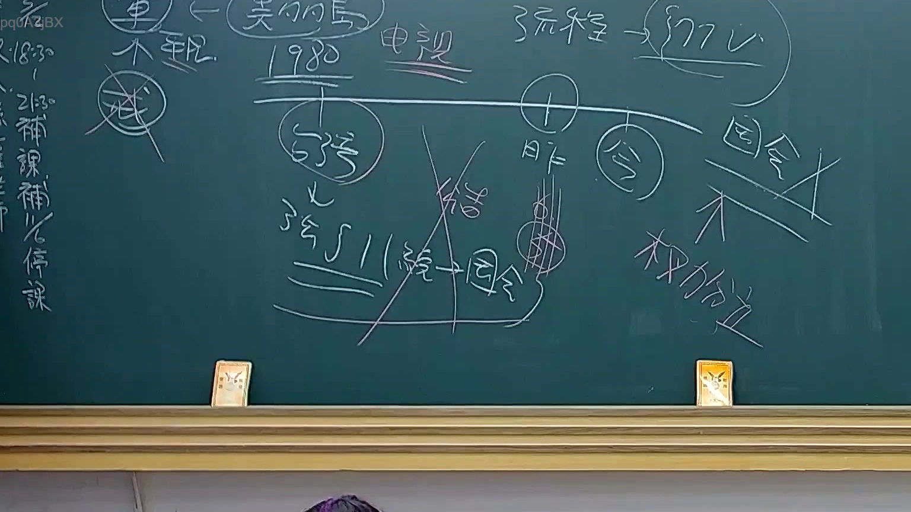

# 🎥 影音教材板書校對筆記
    - **來源影片**: [預約 24 2025-07-31 15-33-47-467](file:///J:/行政法A/ch24/預約 24 2025-07-31 15-33-47-467.mp4)
    - **課程分類**: `[行政法A`
    - **課堂章節**: `ch24]`
    - **影片時間戳記**: `00:10:15` (615 秒)
    - **板書類型**: `影音板書`
    - **偵測時間**: 2026-07-22 03:41:04
    
    ## 🔍 擷取黑板板書對照圖
    
    
    ## 🧠 AI 智慧理解與知識庫演化註記
    ：
根據板書影像，此為針對「憲法解釋或法律變遷」相關課程的教學板書，重點在於說明法律規範的時間演進與國會權限之更迭。

1. **辨識內容**：
   - 左上角：提及「契約自由」、「1980」與「電視」等關鍵字。
   - 中間時間軸：以「昨」（過去）與「今」（現代）劃分。
   - 關鍵字：包含「台灣」、「釋字」、「國會」、「權力分立」。
   - 符號意義：畫面中有「打叉」符號，代表對舊有概念或過時法律見解的否定（如：過去強調國會的絕對權力觀點已被修正）。

2. **法理與對照**：
   - **時間軸概念**：此板書探討法律解釋的「時際法原則」。法律解釋並非一成不變，隨著社會變遷（如電視媒體的普及與契約自由的界限演變），司法院大法官透過解釋（釋字）賦予法律新的生命力。
   - **權力分立**：板書強調「權力分立」，並對比過去（昨）國會獨大或不受制衡的狀態，演變至現代（今）受司法審查（憲法法庭）之制衡。這對應臺灣《憲法》體制下，立法院的立法權受《憲法》規範，以及大法官釋憲權（現為憲法法庭）對立法權的違憲審查制衡。
   - **法條連結**：此內容涉及《憲法》第78條（司法院解釋憲法及統一解釋法律及命令之權）以及相關釋字精神，探討立法權與司法權在不同時期的界線變化。
    
    ## 📊 可編輯之 Mermaid 關係流程圖
    ```mermaid
    ：
graph TD
    A["時間軸 過去(昨) vs. 現在(今)"] --> B["憲法解釋與變遷"]
    B --> C["權力分立原則"]
    C --> D["立法院 (國會)"]
    C --> E["司法審查 (釋字/憲法法庭)"]
    D -.->|受制衡| E
    F["社會變遷 (如 電視/契約自由)"] --> B
    G["舊有絕對國會觀點"] -.->|否定/打叉| H["現代憲政主義"]
    ```
    
    ## ✍️ 操作者手動校對修改區
    <!-- 您可以直接修改上方的文字或調整 Mermaid 區塊中的節點，Obsidian 會即時重新渲染 -->
    - [ ] 欄位結構與法律邏輯已校對無誤。
    - **校對筆記**: 
    