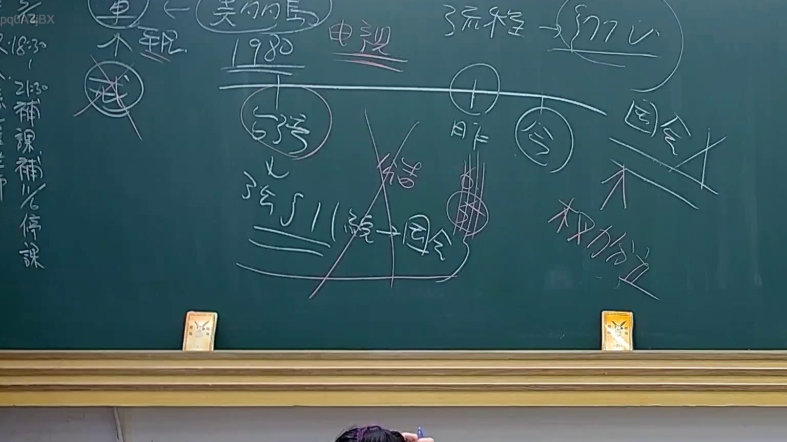

# 🎥 影音教材板書校對筆記
    - **來源影片**: [預約 24 2025-07-31 15-33-47-467](file:///J:/行政法A/ch24/預約 24 2025-07-31 15-33-47-467.mp4)
    - **課程分類**: `[行政法A`
    - **課堂章節**: `ch24]`
    - **影片時間戳記**: `00:14:00` (840 秒)
    - **板書類型**: `影音板書`
    - **偵測時間**: 2026-07-22 03:41:14
    
    ## 🔍 擷取黑板板書對照圖
    
    
    ## 🧠 AI 智慧理解與知識庫演化註記
    ：
本次板書內容涉及臺灣公法學中關於司法院大法官釋憲實務，核心在於處理「法律體系之變遷」與「違憲審查效力」的時間維度。

1. **辨識內容**：
   - 板書主要架構為時間軸，左側標記「1980」，並提及「電視」。
   - 下方出現「大法官」及「釋字第511號」與「國會」之關聯。
   - 繪製了「昨」與「今」的時間對照，強調「權力分立」原則。
   - 畫面中心有明顯的「X」叉號，否定了某種連結，並強調「結論」在不同時空的變遷。

2. **法律學理與法條對照**：
   - **時間維度與釋憲效力**：板書討論的是釋憲實務中，對於「過去法規」於「現今」是否合憲的審查基準。這涉及《司法院大法官審理案件法》（現已修正為《憲法訴訟法》）之釋憲效力。
   - **釋字第511號**：該號解釋涉及「公職人員選舉罷免法」相關爭議。板書將其與「國會」連結，顯示在憲法權力分立架構下，司法權如何劃定國會權限之界線。
   - **權力分立（Separation of Powers）**：板書右下角明確標示「權力分立」。這是憲法之核心基石，意在闡述當國會立法涉及限制人民權利時，大法官（或現今之憲法法庭）如何透過釋憲權進行制衡。
   - **變遷邏輯**：老師透過「昨（過去的法律解釋）」與「今（現在的憲法觀點）」的對比，說明法律解釋並非一成不變，須隨社會演變（如板書提到的電視媒介演變）與憲法意識之提升進行調整。
    
    ## 📊 可編輯之 Mermaid 關係流程圖
    ```mermaid
    ：
graph TD
    A["時間軸 1980年"] --> B["電視傳播法律環境"]
    B --> C["大法官釋字第511號"]
    C --> D{"權力分立結構"}
    D --> E["國會之立法權"]
    D --> F["司法之憲法審查權"]
    G["昨日觀點"] -.-> H["今日法治要求"]
    H --> I["變遷後的法律解釋"]
    ```
    
    ## ✍️ 操作者手動校對修改區
    <!-- 您可以直接修改上方的文字或調整 Mermaid 區塊中的節點，Obsidian 會即時重新渲染 -->
    - [ ] 欄位結構與法律邏輯已校對無誤。
    - **校對筆記**: 
    