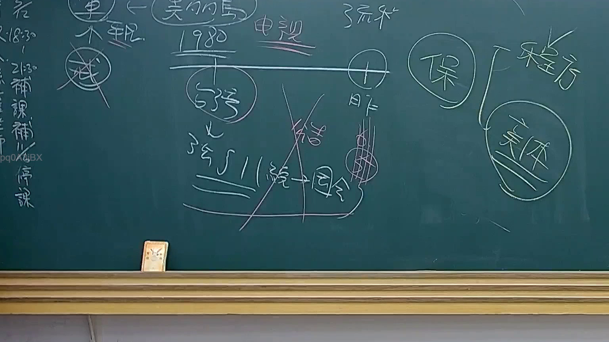

# 🎥 影音教材板書校對筆記
    - **來源影片**: [預約 24 2025-07-31 15-33-47-467](file:///J:/行政法A/ch24/預約 24 2025-07-31 15-33-47-467.mp4)
    - **課程分類**: `[行政法A`
    - **課堂章節**: `ch24]`
    - **影片時間戳記**: `00:18:15` (1095 秒)
    - **板書類型**: `影音板書`
    - **偵測時間**: 2026-07-22 03:41:23
    
    ## 🔍 擷取黑板板書對照圖
    
    
    ## 🧠 AI 智慧理解與知識庫演化註記
    ：
1. 板書內容辨識：
   - 「1980 視聽」（應為電視/視聽設備相關之法律爭議）
   - 「程序」與「實體」之分類：板書右側明確區分「程序」與「實體」兩大法律範疇。
   - 「345 II 統一→因令」：此處指涉最高法院裁判見解的統一機制，即《法院組織法》第57條之1（大法庭制度）。
   - 「結」字被劃掉：暗示在法律適用或程序中，該「結論」或「結案」階段受到挑戰或非正確路徑。
   - 圓圈標記：將「保」（保全程序/保全證據/保護）列為重點。

2. 法律學理對照：
   - 本板書核心在於區分「程序法」與「實體法」的界線。
   - 關於「345 II 統一→因令」：這對應臺灣《法院組織法》關於大法庭提案制度的運作邏輯，旨在解決不同庭審間法律見解不一致的問題。在法律實務中，實體法（如民法第184條侵權行為）的解釋必須透過程序的統一（大法庭）來達成法律秩序的安定性。
   - 該板書展示了法律人在處理爭議時的思考路徑：先確認屬於程序或實體範疇，再確認有無判決見解統一的問題，並釐清是否需要透過保全程序（「保」）來維持實體法上的權益。
    
    ## 📊 可編輯之 Mermaid 關係流程圖
    ```mermaid
    ：
graph TD
    A["法律爭議分析"] --> B["程序法"]
    A --> C["實體法"]
    B --> D["大法庭機制 345 II"]
    D --> E["統一法律見解"]
    E --> F["因令 (具約束力)"]
    A --> G["保全程序 (保)"]
    C -.-> G
    ```
    
    ## ✍️ 操作者手動校對修改區
    <!-- 您可以直接修改上方的文字或調整 Mermaid 區塊中的節點，Obsidian 會即時重新渲染 -->
    - [ ] 欄位結構與法律邏輯已校對無誤。
    - **校對筆記**: 
    