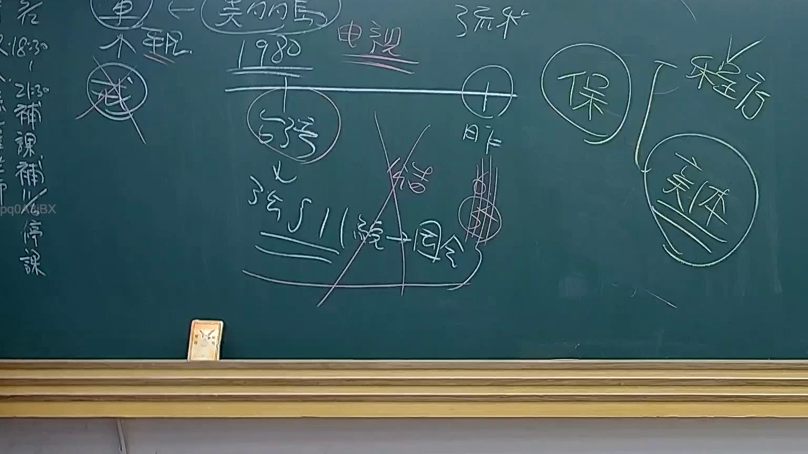

# 🎥 影音教材板書校對筆記
    - **來源影片**: [預約 24 2025-07-31 15-33-47-467](file:///J:/行政法A/ch24/預約 24 2025-07-31 15-33-47-467.mp4)
    - **課程分類**: `[行政法A`
    - **課堂章節**: `ch24]`
    - **影片時間戳記**: `00:19:15` (1155 秒)
    - **板書類型**: `影音板書`
    - **偵測時間**: 2026-07-22 03:41:34
    
    ## 🔍 擷取黑板板書對照圖
    
    
    ## 🧠 AI 智慧理解與知識庫演化註記
    ：
1. **板書內容辨識**：
   - 左側：有「補課」、「停課」等字樣。
   - 中央主體：提及「美約的馬 1980」、「電視」；中間有一橫槓連接「台灣」與「日本」。下方註記「345II（統一）→ 因令」。
   - 右側：標示「保」字，並拉出大括號區分「程序」與「實體」。
   - 符號意義：板書中有顯著的打叉符號（❌），代表否定或不適用的法律邏輯（如連結關係之否定）。

2. **法律學理與法條對照**：
   - **程序法與實體法（保全程序）**：板書右側明確區分「程序」與「實體」，這是民事訴訟法與強制執行法的基本架構。在臺灣法律體系中，涉及「保全程序」（假扣押、假處分），旨在確保實體判決後的強制執行（民事訴訟法第522條以下）。
   - **345II（統一）→ 因令**：此處指涉民法第345條第2項關於買賣契約之成立。老師透過板書討論契約之「統一」與「因果關係」或法律命令之解釋。
   - **國際私法爭點**：板書提到「1980」、「電視」、「台灣」、「日本」，應是在討論涉外民事法律適用法中的國際買賣公約或跨國侵權/契約爭議（如CISG公約之適用）。台灣非CISG簽署國，但常在教學中與日本法進行比較，並探討「連結因素」（連結點）如何決定適用法。

3. **法律邏輯演化**：
   - 「保」字圈選代表保全程序是附屬於實體訴訟之前的階段。
   - 對於「台灣」與「日本」間的連線打叉，可能是在說明特定跨國交易下，無法直接援用某國法律或該管轄權不成立，必須透過涉外民事法律適用法規定的連結因素（如契約地、履行地）來解決。
    
    ## 📊 可編輯之 Mermaid 關係流程圖
    ```mermaid
    ：
graph TD
    A["法律體系"] --> B["程序法"]
    A --> C["實體法"]
    B --> D["保全程序"]
    C --> E["民法第345條第2項(契約成立)"]
    E --> F["連結因素(涉外爭議)"]
    F --> G{"台灣"}
    F --> H{"日本"}
    G -.->|不適用| H
    I["美約的馬 1980"] --> J["跨國交易分析"]
    ```
    
    ## ✍️ 操作者手動校對修改區
    <!-- 您可以直接修改上方的文字或調整 Mermaid 區塊中的節點，Obsidian 會即時重新渲染 -->
    - [ ] 欄位結構與法律邏輯已校對無誤。
    - **校對筆記**: 
    