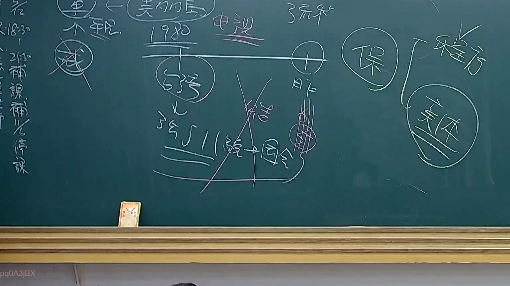

# 🎥 影音教材板書校對筆記
    - **來源影片**: [預約 24 2025-07-31 15-33-47-467](file:///J:/行政法A/ch24/預約 24 2025-07-31 15-33-47-467.mp4)
    - **課程分類**: `[行政法A`
    - **課堂章節**: `ch24]`
    - **影片時間戳記**: `00:21:45` (1305 秒)
    - **板書類型**: `影音板書`
    - **偵測時間**: 2026-07-22 03:41:44
    
    ## 🔍 擷取黑板板書對照圖
    
    
    ## 🧠 AI 智慧理解與知識庫演化註記
    ：

板書內容辨識：
1. 左側時間紀錄：「18:30」、「21:30」、「補課」、「補/停課」。
2. 核心架構：「美國 1980」、「電視」、「3511(統一-因合)」、「保（程方/實體）」。
3. 關鍵邏輯：圖示呈現「美國法（1980年電視相關規範）」與「3511（統一-因合）」的法律關係對照，並將「保」區分為「程方（程序法）」與「實體（實體法）」兩個維度。

法律解讀：
本板書主要探討法律體系中「程序法」與「實體法」的區分與交互作用。
- 「3511（統一-因合）」：此處推測指涉民事訴訟法或相關法規中關於「請求權競合」或「訴訟標的」之處理邏輯，特別是針對「統一」與「因合」（因果結合）的理論架構。
- 程序法與實體法：「保」字在法律語境中常指「保全程序」（如假扣押、假處分），老師透過此圖解說明在處理這類案件時，必須先區分「程方（程序法上的救濟與要件）」與「實體（實體法上的權利基礎，如民法債權）」的界線。
- 法律關聯：這涉及到《民事訴訟法》關於保全程序與實體請求權的關聯。當事人申請保全時，不僅需滿足程序上的要件，其所主張的實體法上請求權（如民法第184條侵權行為損害賠償）是否具備「假扣押之必要」與「請求之原因」，即為本板書所探討的核心。
    
    ## 📊 可編輯之 Mermaid 關係流程圖
    ```mermaid
    ：

graph TD
    A["美國 1980 電視規範"] --> B["3511 統一-因合理論"]
    C["保(保全程序)"] --> D["程方(程序法)"]
    C --> E["實體(實體法)"]
    D -.->|規範適用| F["民事訴訟法保全程序"]
    E -.->|請求權基礎| G["民法侵權行為/契約責任"]
    ```
    
    ## ✍️ 操作者手動校對修改區
    <!-- 您可以直接修改上方的文字或調整 Mermaid 區塊中的節點，Obsidian 會即時重新渲染 -->
    - [ ] 欄位結構與法律邏輯已校對無誤。
    - **校對筆記**: 
    