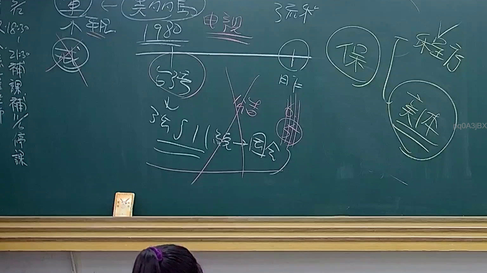

# 🎥 影音教材板書校對筆記
    - **來源影片**: [預約 24 2025-07-31 15-33-47-467](file:///J:/行政法A/ch24/預約 24 2025-07-31 15-33-47-467.mp4)
    - **課程分類**: `[行政法A`
    - **課堂章節**: `ch24]`
    - **影片時間戳記**: `00:25:15` (1515 秒)
    - **板書類型**: `影音板書`
    - **偵測時間**: 2026-07-22 03:41:53
    
    ## 🔍 擷取黑板板書對照圖
    
    
    ## 🧠 AI 智慧理解與知識庫演化註記
    ：
本板書主要呈現法律教學中關於「訴訟法」與「實體法」的基礎區分與關係。
1. **OCR 內容辨識**：
   - 左側文字：「補課」、「補停課」（部分殘缺）。
   - 中間核心：「美的島」、「1980」、「電視」、「385II」、「結合」、「因果」。
   - 右側核心結構：將「保（保全/程序）」與「實體」並列，右側括號標註「程序」與「實體」。
   - 圖示符號：中間有大交叉線，象徵排除或區分關係；下方有「385II」指涉民法第385條第2項（或相關訴訟法條文）。

2. **法律學理與法條對照**：
   - **程序法 vs. 實體法**：板書右側明確區分「程序」與「實體」。這對應我國民事訴訟中，程序法（如民事訴訟法）旨在規範法院審判程序，而實體法（如民法第184條、第385條等）則解決權利義務之本體問題。
   - **385II 與因果關係**：提及「385II」（推測為民法第385條第2項關於試驗買賣之規定，或訴訟法相關說明），並連接「結合」與「因果」，討論的是法律要件的構成。在民法上，侵權行為（第184條）特別重視「因果關係」的判定。
   - **邏輯意涵**：老師透過中間的大交叉與「結合 -> 因果」的箭頭，意在教導學生如何將「訴訟上的請求權基礎」（程序）與「實體法上的權利義務」（實體）進行連結，並確認因果關係鏈是否斷裂。
    
    ## 📊 可編輯之 Mermaid 關係流程圖
    ```mermaid
    ：
graph TD
    A["法律結構"] --> B["程序法"]
    A --> C["實體法"]
    B --> D["保全程序/審理機制"]
    C --> E["民法實體權利義務"]
    E --> F["構成要件分析"]
    F --> G["385II"]
    G --> H["結合"]
    H --> I["因果關係"]
    I -- "判斷邏輯" --> J["法律效果"]
    ```
    
    ## ✍️ 操作者手動校對修改區
    <!-- 您可以直接修改上方的文字或調整 Mermaid 區塊中的節點，Obsidian 會即時重新渲染 -->
    - [ ] 欄位結構與法律邏輯已校對無誤。
    - **校對筆記**: 
    