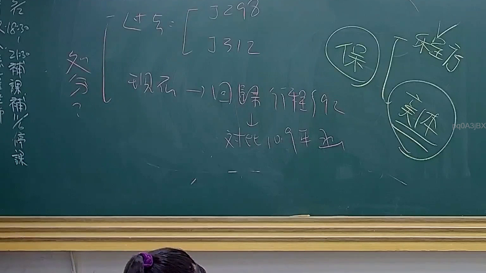

# 🎥 影音教材板書校對筆記
    - **來源影片**: [預約 24 2025-07-31 15-33-47-467](file:///J:/行政法A/ch24/預約 24 2025-07-31 15-33-47-467.mp4)
    - **課程分類**: `[行政法A`
    - **課堂章節**: `ch24]`
    - **影片時間戳記**: `00:31:45` (1905 秒)
    - **板書類型**: `影音板書`
    - **偵測時間**: 2026-07-22 03:42:03
    
    ## 🔍 擷取黑板板書對照圖
    
    
    ## 🧠 AI 智慧理解與知識庫演化註記
    ：

1. **板書內容辨識**：
   - 「處分？」
   - 「過去 = [釋字298, 釋字312]」
   - 「現在 -> 回歸行程 §92」
   - 「對比 109年函」
   - 「保」接引至「程序」、「實體」兩分支。

2. **法律學理與爭點解讀**：
   - **行政處分之定義演變**：板書核心在探討「行政處分」概念的歷史脈絡。早期大法官釋字第298號與312號對於處分性質的認定較為寬鬆，傾向於保護人民權益。
   - **現行法制回歸**：現行實務已回歸行政程序法第92條第1項，將行政處分界定為「行政機關就公法上具體事件所為之決定或其他公權力措施而對外直接發生法律效果之單方行政行為」。
   - **爭點提示**：板書提到「109年函」，應是指行政機關針對特定法律適用之函釋，可能與實務見解（如最高行政法院判決）產生衝突或呼應。
   - **程序與實體**：將「保」（保全或保障）拆解為「程序」與「實體」，意指行政處分的合法性審查不僅要求「程序正義」（如聽證、理由附記等），亦需兼顧「實體內容」的合法與妥當。

3. **法律條文對照**：
   - 行政程序法第92條（行政處分之定義）。
   - 行政程序法第96條（行政處分之方式，即板書提及程序面之要求）。
    
    ## 📊 可編輯之 Mermaid 關係流程圖
    ```mermaid
    ：

graph TD
    A["行政處分認定"] --> B["過去見解"]
    B --> C["釋字298"]
    B --> D["釋字312"]
    A --> E["現行見解"]
    E --> F["回歸行政程序法第92條"]
    F --> G["對比109年函釋"]
    A --> H["保全/保障"]
    H --> I["程序面"]
    H --> J["實體面"]
    ```
    
    ## ✍️ 操作者手動校對修改區
    <!-- 您可以直接修改上方的文字或調整 Mermaid 區塊中的節點，Obsidian 會即時重新渲染 -->
    - [ ] 欄位結構與法律邏輯已校對無誤。
    - **校對筆記**: 
    