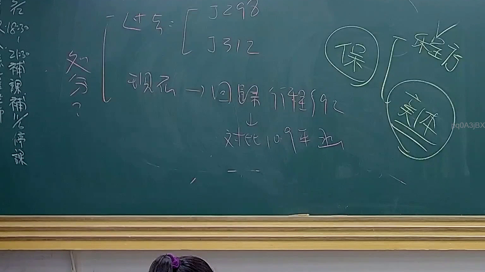

# 🎥 影音教材板書校對筆記
    - **來源影片**: [預約 24 2025-07-31 15-33-47-467](file:///J:/行政法A/ch24/預約 24 2025-07-31 15-33-47-467.mp4)
    - **課程分類**: `[行政法A`
    - **課堂章節**: `ch24]`
    - **影片時間戳記**: `00:32:30` (1950 秒)
    - **板書類型**: `影音板書`
    - **偵測時間**: 2026-07-22 03:42:13
    
    ## 🔍 擷取黑板板書對照圖
    
    
    ## 🧠 AI 智慧理解與知識庫演化註記
    ：
本次板書內容主要涉及行政法中關於「處分」定義的變遷與演進，核心爭點在於大法官釋字與行政程序法規定的連結。

1. **辨識內容**：
   - 「處分」：透過括號引出兩個核心參考大法官釋字：釋字第298號、釋字第312號。
   - 「現在 -> 回歸行程92」：意指行政處分的定義回歸《行政程序法》第92條規定。
   - 「對比109年函」：提到109年的行政函釋（推測為最高行政法院相關決議或主管機關函釋），用於對比過往釋字對處分概念的界定。
   - 「保」與「實體」：板書右側將「處分」進一步分類為「程序」與「實體」保障層面，強調處分之認定不僅是程序規範，更涉及實體法益。

2. **法理與法律對照**：
   - **行政程序法第92條**：這是臺灣行政法關於「行政處分」的定義基準，即「行政機關就公法上具體事件所為之決定或其他公權力措施而對外直接發生法律效果之單方行政行為」。
   - **釋字第298、312號**：早期大法官對於處分的見解，強調特定條件下公務人員的身分保障或權益受損之救濟途徑。
   - **法律演進註記**：板書呈現了從過去大法官釋字個別認定，到行政程序法實施後，逐漸「回歸」並「統一」至法條定義的法律演進邏輯，特別是針對109年後的實務見解，顯示出法律適用對於「處分」認定標準的細緻化與嚴謹化。
    
    ## 📊 可編輯之 Mermaid 關係流程圖
    ```mermaid
    ：
graph TD
    A["處分定義"] --> B["釋字第298號"]
    A --> C["釋字第312號"]
    A --> D["行政程序法第92條"]
    D --> E["109年行政函釋/決議"]
    A --> F["保(程序保障)"]
    A --> G["實體(實體權利)"]
    D -.->|回歸/適用| A
    ```
    
    ## ✍️ 操作者手動校對修改區
    <!-- 您可以直接修改上方的文字或調整 Mermaid 區塊中的節點，Obsidian 會即時重新渲染 -->
    - [ ] 欄位結構與法律邏輯已校對無誤。
    - **校對筆記**: 
    