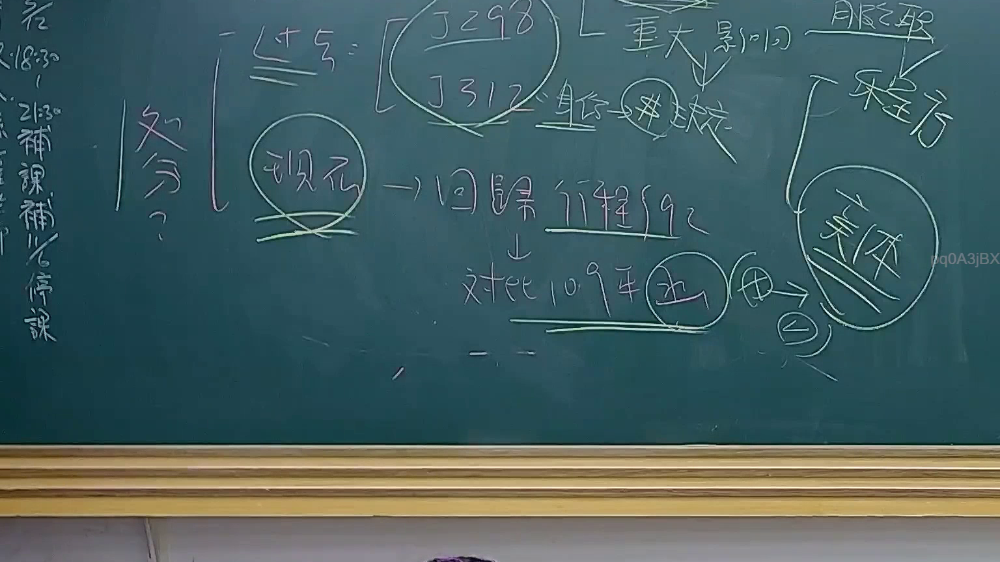

# 🎥 影音教材板書校對筆記
    - **來源影片**: [預約 24 2025-07-31 15-33-47-467](file:///J:/行政法A/ch24/預約 24 2025-07-31 15-33-47-467.mp4)
    - **課程分類**: `[行政法A`
    - **課堂章節**: `ch24]`
    - **影片時間戳記**: `00:39:00` (2340 秒)
    - **板書類型**: `影音板書`
    - **偵測時間**: 2026-07-22 03:42:23
    
    ## 🔍 擷取黑板板書對照圖
    
    
    ## 🧠 AI 智慧理解與知識庫演化註記
    ：
1. 板書文字辨識：
   - 「處分？」
   - 「過往 = [J298, J312] 身份 → 判決」
   - 「重大影響」
   - 「服公職」、「程序」、「實體」
   - 「現在 → 回歸行程§92」
   - 「對比109年 決 (7)」

2. 法律學理與爭點：
   - 本板書探討行政法中「行政處分」概念的演變，特別是關於「行政訴訟」之標的。
   - 「過往」提及釋字第298號與第312號解釋，背景涉及公務人員之身分保障與考績處分。過去司法實務傾向於認為某些行政行為因涉及特別權力關係而不具備「行政處分」之性質，故不得提起行政爭訟。
   - 「現在」與「回歸行徑§92」：係指現行實務在行政程序法第92條定義下，對於行政處分的認定趨於放寬，不再侷限於傳統的「特別權力關係」。
   - 「程序」與「實體」：行政處分之審查邏輯，現今實務傾向於重視程序合法性（行政程序法）與實體正當性。
   - 「對比109年決」：指最高行政法院109年度大字第1號裁定等相關判例，對於行政處分概念之重新定位。

3. 法律條文對照：
   - 行政程序法第92條：行政處分之定義（法效性、外部性、具體性、單方性）。
   - 行政訴訟法第4條：撤銷訴訟之對象須為行政處分。
    
    ## 📊 可編輯之 Mermaid 關係流程圖
    ```mermaid
    ：
graph TD
    A["處分定義之演變"] --> B["過往 J298, J312"]
    B --> C["特別權力關係限制"]
    C --> D["影響審判救濟"]
    A --> E["現在 回歸行政程序法§92"]
    E --> F["實體法與程序法並重"]
    E --> G["109年大法庭裁定"]
    G --> H["放寬處分認定標準"]
    H --> I["服公職權之司法救濟"]
    ```
    
    ## ✍️ 操作者手動校對修改區
    <!-- 您可以直接修改上方的文字或調整 Mermaid 區塊中的節點，Obsidian 會即時重新渲染 -->
    - [ ] 欄位結構與法律邏輯已校對無誤。
    - **校對筆記**: 
    