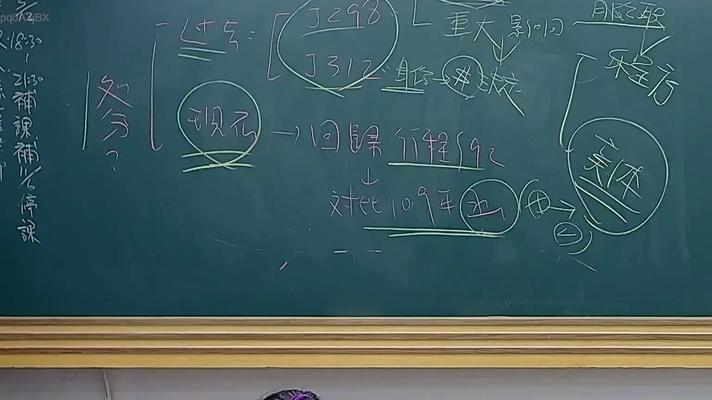

# 🎥 影音教材板書校對筆記
    - **來源影片**: [預約 24 2025-07-31 15-33-47-467](file:///J:/行政法A/ch24/預約 24 2025-07-31 15-33-47-467.mp4)
    - **課程分類**: `[行政法A`
    - **課堂章節**: `ch24]`
    - **影片時間戳記**: `00:41:15` (2475 秒)
    - **板書類型**: `影音板書`
    - **偵測時間**: 2026-07-22 03:42:34
    
    ## 🔍 擷取黑板板書對照圖
    
    
    ## 🧠 AI 智慧理解與知識庫演化註記
    ：

本次板書核心議題在於行政法中「處分」的概念及其判斷基準，特別是針對司法院大法官解釋（釋字）與行政程序法關於「行政處分」的認定標準進行論述。

1. **文字辨識與核心概念**：
   - 「處分？」：這是行政法考點的核心，即如何判斷一項行為是否構成「行政處分」。
   - 「釋字第298號、312號」：這些解釋通常涉及公務員保障或地位的變動，板書指出其涉及「重大影響」。
   - 「回歸行程（行政程序法）第92條」：這是行政程序法中關於行政處分的定義。板書意指在釋字判斷之後，法體系最終回歸適用《行政程序法》第92條第1項之定義（即行政機關就公法上具體事件所為之決定或其他公權力措施，而對外直接發生法律效果之單方行政行為）。
   - 「程序方」、「實體」：行政處分之判斷需涵蓋程序保障與實體法律效果。
   - 「對比109年...」：這裡提到109年的變革（可能指大法官解釋或最高行政法院之實務見解演變，如釋字第785號後續關於程序保障的深化）。

2. **法律條文對照與演化**：
   - **行政程序法第92條**：本法條為臺灣行政法判定「行政處分」的黃金標準，具備四要素：(1)行政機關、(2)具體事件、(3)公法性質、(4)直接對外發生法律效果。
   - **學理演進**：板書意在梳理從早期透過大法官解釋（如釋字298、312）來界定公務員權益受損是否為處分，演進至現代強調依循《行政程序法》及相關程序保障機制（實體與程序的辯證）。這體現了行政爭訟從「處分相對人理論」向「權利保護必要說」的演化。
    
    ## 📊 可編輯之 Mermaid 關係流程圖
    ```mermaid
    ：

graph TD
    A["處分定義判斷"] --> B["釋字 298 / 312 號解釋"]
    B --> C["重大影響判斷"]
    C --> D["回歸行政程序法第92條"]
    D --> E["程序方"]
    D --> F["實體"]
    E & F --> G["行政處分之構成"]
    D --> H["109年後相關實務見解對比"]
    ```
    
    ## ✍️ 操作者手動校對修改區
    <!-- 您可以直接修改上方的文字或調整 Mermaid 區塊中的節點，Obsidian 會即時重新渲染 -->
    - [ ] 欄位結構與法律邏輯已校對無誤。
    - **校對筆記**: 
    