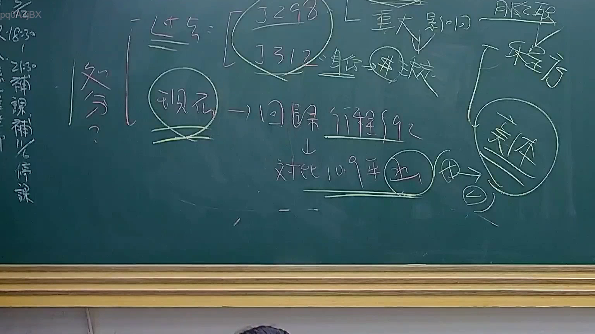

# 🎥 影音教材板書校對筆記
    - **來源影片**: [預約 24 2025-07-31 15-33-47-467](file:///J:/行政法A/ch24/預約 24 2025-07-31 15-33-47-467.mp4)
    - **課程分類**: `[行政法A`
    - **課堂章節**: `ch24]`
    - **影片時間戳記**: `00:42:00` (2520 秒)
    - **板書類型**: `影音板書`
    - **偵測時間**: 2026-07-22 03:42:44
    
    ## 🔍 擷取黑板板書對照圖
    
    
    ## 🧠 AI 智慧理解與知識庫演化註記
    ：
本次板書內容主要圍繞行政訴訟法中關於「處分」的定義及其核心爭議，並引用司法院大法官釋字與最高行政法院決議作為判準。

1. **核心概念：處分（行政處分）**
   - 老師透過「釋字第298號」與「釋字第312號」連結，指出該兩號解釋涉及行政行為的本質與「重大影響」。
   - 「重大影響」在實務上常用於界定行政行為是否構成行政處分，即該行為是否對人民之權利產生直接且重大之法律效果。
   - 「身分」、「決」：此處可能指公務人員的身分保障或相關人事行政決策。

2. **理論演進：現況與回歸程序**
   - 板書強調「現況」應回歸至「行程法（行政程序法）」的規範邏輯。
   - 「對比109年決」：指涉最高行政法院109年度的大型決議或法律座談會意見，針對行政處分認定標準的修正或限縮（可能與實體/程序區分有關）。
   - 「實體」、「程序」：此二者在行政訴訟中具有重要區別，實體爭議往往涉及違法性與權利侵害，而程序爭議則涉及審查標準（如程序瑕疵能否補正）。

3. **法律對照**
   - **行政程序法第92條**：行政處分之定義。
   - **行政訴訟法**：對於「處分」的界定直接關係到「訴訟類型」的選擇（如撤銷訴訟與課予義務訴訟之區辨）。
   - 釋字第298、312號：主要涉及公務員保障法與公法上職務關係的變動是否構成行政處分之界限。
    
    ## 📊 可編輯之 Mermaid 關係流程圖
    ```mermaid
    ：
graph TD
    A["處分"] --> B["釋字第298號"]
    A --> C["釋字第312號"]
    B & C --> D["重大影響"]
    D --> E["身份"]
    E --> F["決定"]
    G["現況"] --> H["回歸行政程序法"]
    H --> I["對比109年決議"]
    I --> J["實體"]
    I --> K["程序"]
    J --> L["程序與實體之區辨"]
    ```
    
    ## ✍️ 操作者手動校對修改區
    <!-- 您可以直接修改上方的文字或調整 Mermaid 區塊中的節點，Obsidian 會即時重新渲染 -->
    - [ ] 欄位結構與法律邏輯已校對無誤。
    - **校對筆記**: 
    