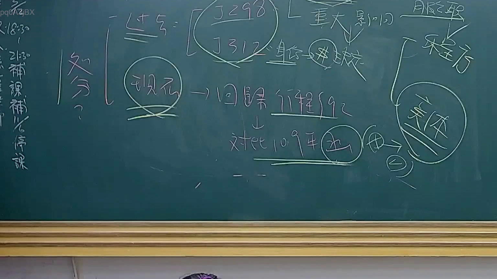

# 🎥 影音教材板書校對筆記
    - **來源影片**: [預約 24 2025-07-31 15-33-47-467](file:///J:/行政法A/ch24/預約 24 2025-07-31 15-33-47-467.mp4)
    - **課程分類**: `[行政法A`
    - **課堂章節**: `ch24]`
    - **影片時間戳記**: `00:43:00` (2580 秒)
    - **板書類型**: `影音板書`
    - **偵測時間**: 2026-07-22 03:42:54
    
    ## 🔍 擷取黑板板書對照圖
    
    
    ## 🧠 AI 智慧理解與知識庫演化註記
    ：

本次板書內容涉及臺灣行政法領域，特別是關於「行政處分」之撤銷、廢止與相關釋字見解的權衡。

1. **板書內容辨識**：
   - 核心關鍵字：「處分」、「J298」、「J312」、「重大影響」、「現況」、「回歸行程 §92」、「對比 109年」、「函」、「體」、「程序」。
   - 邏輯結構：將「處分」的效力與檢驗標準分為兩大路徑：
     - 路徑一：引用大法官釋字第 298 號、第 312 號，探討「重大影響」與程序要件。
     - 路徑二：強調「現況」與「回歸行程 §92」（行政程序法第92條，行政處分之定義），並連結至「109年」的相關判決或見解。

2. **法理與實務對照**：
   - **行政程序法第92條**：定義了行政處分，板書提示應回歸此基礎定義進行檢驗。
   - **釋字第298號與第312號**：主要涉及行政機關對公務人員之處分與程序保障，強調若處分有瑕疵，需考量其瑕疵是否重大且明顯，以及是否會對公益造成重大影響。
   - **109年見解**：可能指向最高行政法院大法庭關於行政處分撤銷或訴訟爭點之統一見解（如涉及撤銷訴訟與義務訴訟之界線或程序補正），這是近年行政法考試的熱點。
   - **邏輯意涵**：老師試圖教導學生在面對行政處分爭訟時，先確認是否符合 §92 定義，再引用釋字進行比例原則或程序瑕疵的權衡，最後對比近年（109年）實務演變，判斷該處分是合法有效、無效，還是有撤銷事由。
    
    ## 📊 可編輯之 Mermaid 關係流程圖
    ```mermaid
    ：

graph TD
    A["行政處分 (§92)"] --> B["現況檢驗"]
    B --> C["回歸行政程序法"]
    C --> D["釋字檢驗 (J298, J312)"]
    D --> E["重大影響評估"]
    E --> F["程序瑕疵與合法性判斷"]
    F --> G["對比 109年實務見解"]
    G --> H["綜合結論 (函/體/程序)"]
    ```
    
    ## ✍️ 操作者手動校對修改區
    <!-- 您可以直接修改上方的文字或調整 Mermaid 區塊中的節點，Obsidian 會即時重新渲染 -->
    - [ ] 欄位結構與法律邏輯已校對無誤。
    - **校對筆記**: 
    