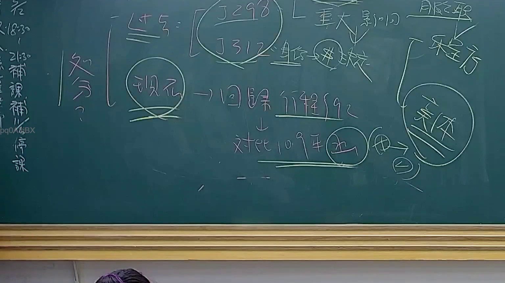

# 🎥 影音教材板書校對筆記
    - **來源影片**: [預約 24 2025-07-31 15-33-47-467](file:///J:/行政法A/ch24/預約 24 2025-07-31 15-33-47-467.mp4)
    - **課程分類**: `[行政法A`
    - **課堂章節**: `ch24]`
    - **影片時間戳記**: `00:44:15` (2655 秒)
    - **板書類型**: `影音板書`
    - **偵測時間**: 2026-07-22 03:43:04
    
    ## 🔍 擷取黑板板書對照圖
    
    
    ## 🧠 AI 智慧理解與知識庫演化註記
    ：
1. **板書內容識別**：
   - 核心關鍵詞：「處分」、「J298」、「J312」、「身分」、「重大影響」、「現行」、「回歸行政程序法」、「體系」、「對比109年」、「函」、「旨」。
   - 左側垂直文字為補充資訊：「補課」、「停課」。

2. **法律學理與爭點解析**：
   - 本板書探討的是行政法領域中關於「行政處分」的認定與救濟體系。
   - **J298 與 J312**：係指司法院大法官釋字第298號與第312號。前者與公務人員身分保障有關；後者則涉及行政處分之定義與性質。老師強調此二釋字在認定「身分」變動或剝奪時，若具有「重大影響」，則傾向認定為行政處分，可受司法審查。
   - **回歸行政程序法**：隨著行政程序法之施行，過往依賴釋字判斷的性質，逐漸回歸由《行政程序法》第92條定義之「行政處分」概念來處理。
   - **109年對比**：提及109年（可能指相關行政法院判決或實務見解之轉變），針對「函」或「旨」這類非典型行政行為，是否構成行政處分，採取更嚴謹的「體系」解釋。核心爭點在於該行政行為是否對人民權利造成直接且重大的法律效果。

3. **法律條文對照**：
   - **行政程序法第92條**：行政處分之定義，重點在於單方性、外部性、公法關係、具體事件及法效性。
   - **行政訴訟法第4條、第8條**：撤銷訴訟與一般給付訴訟之區分，若確認為行政處分，則走撤銷訴訟體系。
    
    ## 📊 可編輯之 Mermaid 關係流程圖
    ```mermaid
    ：
graph TD
    A["處分定義"] --> B["J298/J312 實務見解"]
    B --> C{"是否涉及身分變動"}
    C -->|是| D["重大影響"]
    C -->|否| E["一般行政行為"]
    D --> F["行政處分"]
    F --> G["行政程序法第92條"]
    G --> H["109年體系解釋"]
    H --> I["函/旨/觀念通知"]
    I --> J["確認是否為處分"]
    J --> K["回歸行政訴訟救濟"]
    ```
    
    ## ✍️ 操作者手動校對修改區
    <!-- 您可以直接修改上方的文字或調整 Mermaid 區塊中的節點，Obsidian 會即時重新渲染 -->
    - [ ] 欄位結構與法律邏輯已校對無誤。
    - **校對筆記**: 
    