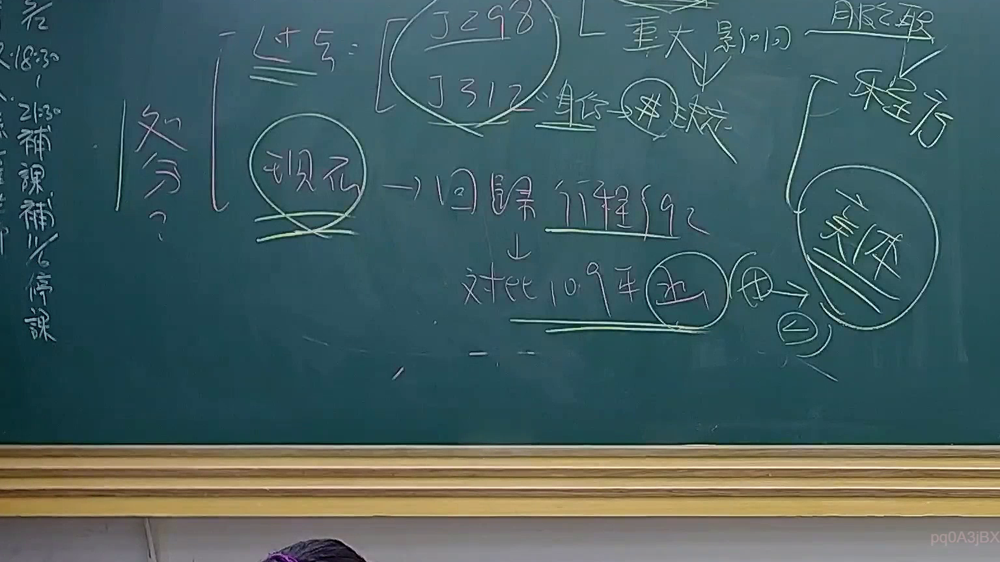

# 🎥 影音教材板書校對筆記
    - **來源影片**: [預約 24 2025-07-31 15-33-47-467](file:///J:/行政法A/ch24/預約 24 2025-07-31 15-33-47-467.mp4)
    - **課程分類**: `[行政法A`
    - **課堂章節**: `ch24]`
    - **影片時間戳記**: `00:46:30` (2790 秒)
    - **板書類型**: `影音板書`
    - **偵測時間**: 2026-07-22 03:43:13
    
    ## 🔍 擷取黑板板書對照圖
    
    
    ## 🧠 AI 智慧理解與知識庫演化註記
    ：
此板書主要探討行政法中關於「處分」的認定與爭議，核心在於處理行政行為的救濟與程序保障。

1. **OCR 內容辨識**：
   - 左側：處分？
   - 中央核心：現行 → 回歸行程 §92、釋字第298、312號（重大影響）、行政法院。
   - 下方：對應109年（函）、（由...轉向實體）。
   - 右側：程序、實體。

2. **法律學理與法條對照**：
   - **處分認定（行政程序法第92條）**：板書中「現行 → 回歸行程§92」指的是針對「行政處分」的定義，即行政機關就公法上具體事件所為之決定或其他公權力措施。
   - **重大影響與釋字引用**：引用「釋字第298號」與「釋字第312號」，這是行政法教學中關於「行政處分」判斷標準的經典解釋，強調對於當事人權利是否產生「重大影響」作為判斷是否為處分及有無救濟必要之指標。
   - **程序與實體**：板書區分「程序」與「實體」，在行政訴訟中，區分程序標的與實體標的至關重要，關係到訴訟請求的合法性與實效性。
   - **109年函釋/決議**：對照109年的相關行政法規意見，指出實務界對於某些具體函釋性質的認定，是否應轉向「實體」面審查，或是維持程序上的處分審查。
    
    ## 📊 可編輯之 Mermaid 關係流程圖
    ```mermaid
    ：
graph TD
    A["處分定義認定"] --> B["行政程序法 §92"]
    B --> C["釋字第298號"]
    B --> D["釋字第312號"]
    C & D --> E["重大影響之判斷"]
    E --> F["行政法院救濟"]
    F --> G["程序審查"]
    F --> H["實體審查"]
    I["109年相關函釋"] --> H
    ```
    
    ## ✍️ 操作者手動校對修改區
    <!-- 您可以直接修改上方的文字或調整 Mermaid 區塊中的節點，Obsidian 會即時重新渲染 -->
    - [ ] 欄位結構與法律邏輯已校對無誤。
    - **校對筆記**: 
    