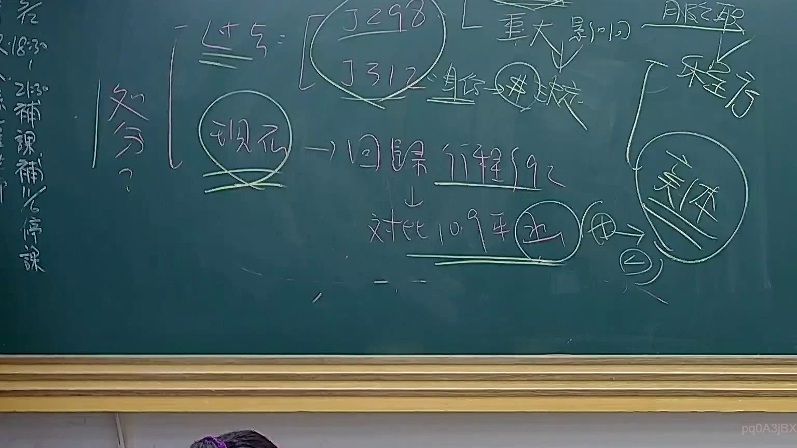

# 🎥 影音教材板書校對筆記
    - **來源影片**: [預約 24 2025-07-31 15-33-47-467](file:///J:/行政法A/ch24/預約 24 2025-07-31 15-33-47-467.mp4)
    - **課程分類**: `[行政法A`
    - **課堂章節**: `ch24]`
    - **影片時間戳記**: `00:47:00` (2820 秒)
    - **板書類型**: `影音板書`
    - **偵測時間**: 2026-07-22 03:43:24
    
    ## 🔍 擷取黑板板書對照圖
    
    
    ## 🧠 AI 智慧理解與知識庫演化註記
    ：
本板書核心在探討行政法中關於「處分」與「救濟」的界線與演變，特別是關於釋字解釋的引用以及救濟途徑的選擇。

1. **關鍵文字辨識**：
   - 「處分？」：行政行為是否為處分之爭點。
   - 「釋298」、「釋312」：引用司法院大法官釋字，後續導向「重大影響」與「身分」作為判斷標準。
   - 「現行→回歸行政程序法92條」：強調現行法制下，處分之認定回歸《行政程序法》第92條定義。
   - 「對比109年(決)」：應是指最高行政法院109年大字第1號裁定等相關判例，討論程序與實體之區分。
   - 「程序」、「實體」：區辨救濟方式的核心概念。

2. **法學邏輯說明**：
   - 歷史脈絡：過去透過大法官解釋（釋298、312）來界定是否為處分（強調身分與重大影響），現在則回歸《行政程序法》第92條之構成要件。
   - 救濟路徑：板書呈現「程序」與「實體」的區別，這通常對應行政訴訟法上對於「訴訟類型」的選擇，即確認處分存在與否，直接影響後續權利保護的範圍。
   - 連結條文：行政程序法第92條（行政處分之定義）、行政訴訟法（撤銷訴訟與確認訴訟之區辨）。
    
    ## 📊 可編輯之 Mermaid 關係流程圖
    ```mermaid
    ：
graph TD
    A["處分界定"] --> B["釋字298/312 (舊制)"]
    B --> C["重大影響"]
    B --> D["身分"]
    A --> E["現行法 行政程序法第92條"]
    E --> F["回歸程序法規"]
    F --> G["救濟路徑"]
    G --> H["程序 (Procedural)"]
    G --> I["實體 (Substantive)"]
    H --> J["對比109年決議"]
    I --> J
    ```
    
    ## ✍️ 操作者手動校對修改區
    <!-- 您可以直接修改上方的文字或調整 Mermaid 區塊中的節點，Obsidian 會即時重新渲染 -->
    - [ ] 欄位結構與法律邏輯已校對無誤。
    - **校對筆記**: 
    