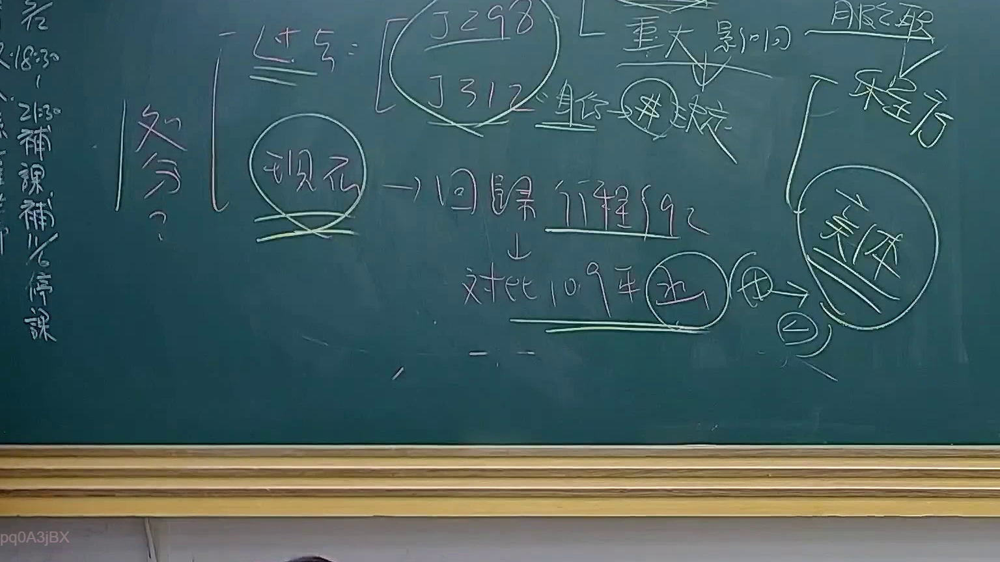

# 🎥 影音教材板書校對筆記
    - **來源影片**: [預約 24 2025-07-31 15-33-47-467](file:///J:/行政法A/ch24/預約 24 2025-07-31 15-33-47-467.mp4)
    - **課程分類**: `[行政法A`
    - **課堂章節**: `ch24]`
    - **影片時間戳記**: `00:51:30` (3090 秒)
    - **板書類型**: `影音板書`
    - **偵測時間**: 2026-07-22 03:43:34
    
    ## 🔍 擷取黑板板書對照圖
    
    
    ## 🧠 AI 智慧理解與知識庫演化註記
    ：
本板書核心在於探討公法上「處分」的定義及其認定標準的演變，特別是針對行政訴訟法上對於「行政處分」的司法審查邏輯。

1. **文字辨識內容**：
   - 「處分？」、「過往=」：指過去對於行政處分的狹隘界定。
   - 「[J298/J312]」：指司法院釋字第 298 號與第 312 號解釋，針對公務員權益等特殊身分關係之救濟。
   - 「重大影響」、「身分」、「核心」：指釋字界定行政處分需具備對人民權益之重大影響。
   - 「現況 -> 回歸行程§92」：代表現行行政程序法第 92 條第 1 項關於行政處分之定義，強調「直接對外發生法律效果」。
   - 「對比109年決」、「客體」、「服從」、「程序」：引用 109 年度之行政法院判例或決議，重新審視特別權力關係變遷下，對於行政處分客體及程序要求的判斷。

2. **法理與法律對照**：
   - **行政程序法第 92 條**：本板書強調「回歸」此條文，即行政行為必須具備單方性、公法性、外部性及法律效果，方構成行政處分。
   - **釋字變遷（由 298/312 到現況）**：過往採取「特別權力關係」理論，對於公務員或學生等身分之處分多不認為是行政處分（不准爭訟）。現今實務已大幅放寬，回歸實質行政處分定義，保障人民受憲法第 16 條訴訟權之保障。
   - **核心爭點**：在於如何區分「行政規則（內部程序）」與「行政處分（外部法律效果）」。109 年之相關實務見解，旨在釐清當行政行為涉及人民權利義務之「重大影響」時，縱使具備特定程序性，仍應視為行政處分。
    
    ## 📊 可編輯之 Mermaid 關係流程圖
    ```mermaid
    ：
graph TD
    A["處分定義之演變"] --> B["過往認定 釋字298/312"]
    B --> C["重大影響與身分地位限制"]
    A --> D["現況認定 回歸行政程序法第92條"]
    D --> E["具備直接對外發生法律效果"]
    D --> F["109年實務決議對比"]
    F --> G["客體 行政處分之重新界定"]
    G --> H["服從義務與程序之審查"]
    ```
    
    ## ✍️ 操作者手動校對修改區
    <!-- 您可以直接修改上方的文字或調整 Mermaid 區塊中的節點，Obsidian 會即時重新渲染 -->
    - [ ] 欄位結構與法律邏輯已校對無誤。
    - **校對筆記**: 
    