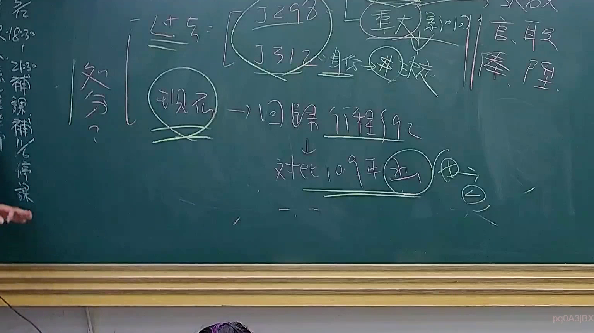

# 🎥 影音教材板書校對筆記
    - **來源影片**: [預約 24 2025-07-31 15-33-47-467](file:///J:/行政法A/ch24/預約 24 2025-07-31 15-33-47-467.mp4)
    - **課程分類**: `[行政法A`
    - **課堂章節**: `ch24]`
    - **影片時間戳記**: `00:58:45` (3525 秒)
    - **板書類型**: `影音板書`
    - **偵測時間**: 2026-07-22 03:43:43
    
    ## 🔍 擷取黑板板書對照圖
    
    
    ## 🧠 AI 智慧理解與知識庫演化註記
    ：

板書內容辨識：
1. 「處分？」、「過去＝（J298、J312）→ 重大影響 → 係爭 ＋ 決定」、「現在 → 回歸 行程法92」、「對比 109年 函 → 個」

法律學理與爭點解析：
本板書探討臺灣行政法上「行政處分」概念的演變與認定標準。
- 「過去」時期：參考大法官釋字第298號與第312號，當時採取較為實質的標準，強調「重大影響」作為判斷行政處分的指標，認為具有法律上之重大影響者即屬行政處分。
- 「現在」趨勢：回歸《行政程序法》第92條第1項規定，即具體、外部、發生法律效果之單方行政行為。強調以法定的嚴謹定義為準。
- 「對比 109年 函」：此處指涉最高行政法院109年度相關裁判或座談會結論，針對「個案函釋」是否具有行政處分性質進行區辨。若該函釋直接對外發生權利義務變動，則認定為行政處分；若僅為觀念通知或法規解釋，則否。
- 法律對照：行政程序法第92條（行政處分之定義）、訴願法第3條。板書呈現出從早期司法解釋擴張認定，轉向回歸法定構成要件的解釋邏輯。
    
    ## 📊 可編輯之 Mermaid 關係流程圖
    ```mermaid
    ：

graph TD
    A["處分概念演變"] --> B["過去：釋字298、312"]
    B --> C["重大影響判斷"]
    C --> D["係爭、決定"]
    A --> E["現在：回歸行政程序法第92條"]
    E --> F["對比：109年函釋"]
    F --> G["個案認定"]
    ```
    
    ## ✍️ 操作者手動校對修改區
    <!-- 您可以直接修改上方的文字或調整 Mermaid 區塊中的節點，Obsidian 會即時重新渲染 -->
    - [ ] 欄位結構與法律邏輯已校對無誤。
    - **校對筆記**: 
    