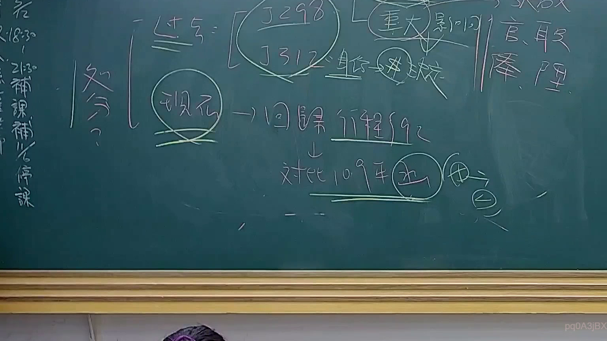

# 🎥 影音教材板書校對筆記
    - **來源影片**: [預約 24 2025-07-31 15-33-47-467](file:///J:/行政法A/ch24/預約 24 2025-07-31 15-33-47-467.mp4)
    - **課程分類**: `[行政法A`
    - **課堂章節**: `ch24]`
    - **影片時間戳記**: `01:05:45` (3945 秒)
    - **板書類型**: `影音板書`
    - **偵測時間**: 2026-07-22 03:43:54
    
    ## 🔍 擷取黑板板書對照圖
    
    
    ## 🧠 AI 智慧理解與知識庫演化註記
    ：

板書內容分析：
1. 【板書辨識】：
   - 左側大括號內包含：「過失= [釋字298/釋字312] 結合 -> 非決定」、「現行 -> 回歸行程92」、「對比109年(函) -> (函)」。
   - 右側：「重大影響」、「官、職、俸、陞」。
   - 左邊側標：「處分？」、「21:30 補課」、「補課/停課」。

2. 【法律學理與法條對照】：
   - 本板書涉及「公務員行政處分」的法律變遷與責任歸屬。
   - 「釋字第298號」與「釋字第312號」：涉及公務員身分保障與行政處分之救濟，強調行政機關對於公務員懲處或權益變更時，必須具備法律依據與正當程序。
   - 「過失」、「重大影響」：對應《國家賠償法》第2條第2項之公務員執行職務致人民權益損害，以及行政程序法對於行政處分違法與否的認定要件。
   - 「回歸行程92」與「109年(函)」：指行政訴訟法或相關行政法規（如行政程序法）解釋之變遷。行政機關往往透過「函釋」來補充法律之不足，但函釋之法律位階與適用範圍常是行政訴訟的攻防重點。
   - 結論：板書討論的是行政法中對於「過失」認定之演進，從早期的釋字解釋，過渡到現行實務對於「重大影響」公務員身分（如官、職、俸、陞）之行政處分審查標準，特別是對於行政函釋是否能構成行政處分或足以影響公務員權益的探討。
    
    ## 📊 可編輯之 Mermaid 關係流程圖
    ```mermaid
    ：
graph TD
    A["過失認定標準"] --> B["釋字298/312"]
    B --> C["非絕對決定"]
    A --> D["現行法律體系"]
    D --> E["回歸行程92"]
    E --> F["對比109年(函)"]
    F --> G["行政處分效力"]
    G --> H["重大影響官職俸陞"]
    ```
    
    ## ✍️ 操作者手動校對修改區
    <!-- 您可以直接修改上方的文字或調整 Mermaid 區塊中的節點，Obsidian 會即時重新渲染 -->
    - [ ] 欄位結構與法律邏輯已校對無誤。
    - **校對筆記**: 
    