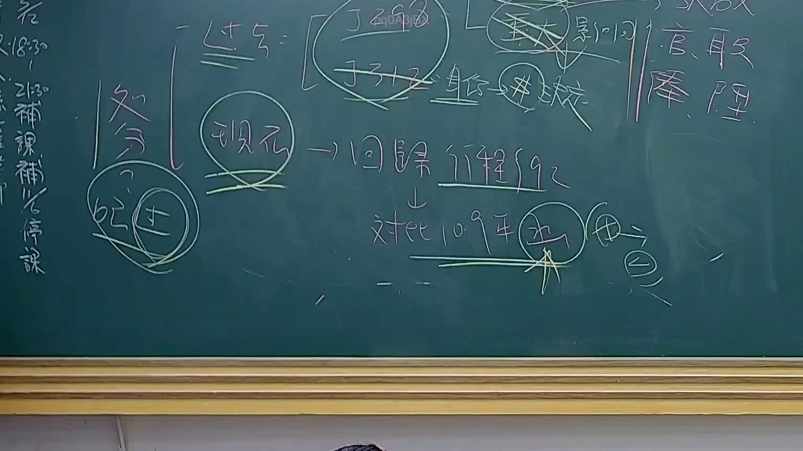

# 🎥 影音教材板書校對筆記
    - **來源影片**: [預約 24 2025-07-31 15-33-47-467](file:///J:/行政法A/ch24/預約 24 2025-07-31 15-33-47-467.mp4)
    - **課程分類**: `[行政法A`
    - **課堂章節**: `ch24]`
    - **影片時間戳記**: `01:09:45` (4185 秒)
    - **板書類型**: `影音板書`
    - **偵測時間**: 2026-07-22 03:44:04
    
    ## 🔍 擷取黑板板書對照圖
    
    
    ## 🧠 AI 智慧理解與知識庫演化註記
    ：
根據板書內容，老師探討的是法律解釋中的「時間向度」與「法源適用」，主要架構如下：

1. **辨識內容**：
   - 「過去」對應到「重大影響」與「身分」關係（判定是否有法源依據）。
   - 「現在」對應到「回歸行程 92」，下方進一步指向「對比 109 年」，並連結到「未來」（指向「田」或「由」的符號，表示後續進程）。
   - 「處分」旁標註「記土（或紀士）」，可能是針對特定行政處分或裁判後的記憶點。

2. **法理與法條對照**：
   - **法不溯及既往原則**：板書中「過去」、「現在」、「未來」的區分，對應《中央法規標準法》第13條及法律不溯及既往原則。法律適用時，需檢視該法律事實發生在何時，以決定適用舊法或新法。
   - **行政程序法第92條**：板書提到的「92」應指《行政程序法》第92條關於「行政處分」的定義。這是行政法核心概念，區分事實行為與行政處分。
   - **判例與時間軸**：板書中的「109年」可能指涉相關的重要最高行政法院判決或大法官釋字（例如釋字第793號或相關稅法、身分法變更之解釋），用以說明法律見解的變動對現行處分的影響。

3. **邏輯意義**：
   - 此架構在教導學生處理法律爭點時，必須建立時間軸：先確認「過去」的權利義務關係（特別是身分法），再分析「現在」該行為是否構成行政處分（依據行訴法或行程序法），最後看「未來」對當事人的效力與救濟。
    
    ## 📊 可編輯之 Mermaid 關係流程圖
    ```mermaid
    ：
graph TD
    A["過去 重大影響/身分"] --> B["現在 回歸行程 92"]
    B --> C["對比 109 年"]
    C --> D["未來 處分/權利義務"]
    E["處分 記土"] -.-> A
    ```
    
    ## ✍️ 操作者手動校對修改區
    <!-- 您可以直接修改上方的文字或調整 Mermaid 區塊中的節點，Obsidian 會即時重新渲染 -->
    - [ ] 欄位結構與法律邏輯已校對無誤。
    - **校對筆記**: 
    