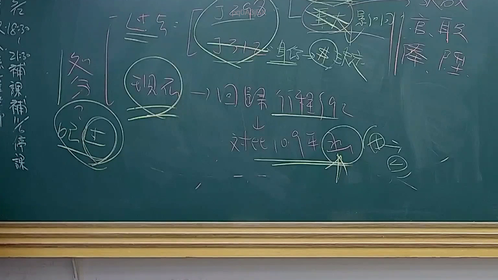

# 🎥 影音教材板書校對筆記
    - **來源影片**: [預約 24 2025-07-31 15-33-47-467](file:///J:/行政法A/ch24/預約 24 2025-07-31 15-33-47-467.mp4)
    - **課程分類**: `[行政法A`
    - **課堂章節**: `ch24]`
    - **影片時間戳記**: `01:10:30` (4230 秒)
    - **板書類型**: `影音板書`
    - **偵測時間**: 2026-07-22 03:44:14
    
    ## 🔍 擷取黑板板書對照圖
    
    
    ## 🧠 AI 智慧理解與知識庫演化註記
    ：
1. **板書文字辨識**：
   - 「處分」
   - 「記過」
   - 「現在」 → 「回歸行程92」 → 「對應109年決」 → 「原因」
   - 右側符號/文字：「重大影響」、「官、職、俸、陞、降」
   - 頂部運算符號：「(丁/子) = [重大影響] → #決定」

2. **法律學理與爭點**：
   - 此板書主要探討行政法中「行政處分」的司法審查邏輯，特別是針對公務員懲戒或行政處分中的「重大影響」判斷標準。
   - 「現在 → 回歸行程92」：暗示在處理行政程序時，應回歸《行政程序法》第92條關於行政處分的定義及其構成要件。
   - 「對應109年決」：指涉最高行政法院的法律見解（如109年度相關聯席會議決議），這類決議通常針對「得否提起行政訴訟」或「處分性質」進行明確化。
   - 「官、職、俸、陞、降」：代表行政處分影響公務員之身分保障或財產權的核心權益，若處分未達上述嚴重程度，是否構成得救濟之行政處分，為本節課核心爭點。
   - 連結條文：主要對應《行政程序法》第92條（行政處分之定義）、《行政訴訟法》第4條（撤銷訴訟）及《公務人員保障法》相關救濟規定。

3. **法律註記**：
   - 實務演化重點：109年後的實務見解傾向於將「是否對當事人產生法律上之重大影響」作為判斷行政行為是否為「行政處分」的關鍵標準。若行為僅具內部管理性質（如單純勸導、口頭提醒），則非行政處分，不可提行政訴訟。
    
    ## 📊 可編輯之 Mermaid 關係流程圖
    ```mermaid
    ：
graph TD
    A["行政行為"] --> B["行政程序法第92條"]
    B --> C{"是否有重大影響"}
    C -- "是" --> D["行政處分"]
    C -- "否" --> E["內部管理/事實行為"]
    D --> F["官、職、俸、陞、降之變動"]
    D --> G["109年決議"]
    G --> H["提起行政救濟"]
    ```
    
    ## ✍️ 操作者手動校對修改區
    <!-- 您可以直接修改上方的文字或調整 Mermaid 區塊中的節點，Obsidian 會即時重新渲染 -->
    - [ ] 欄位結構與法律邏輯已校對無誤。
    - **校對筆記**: 
    