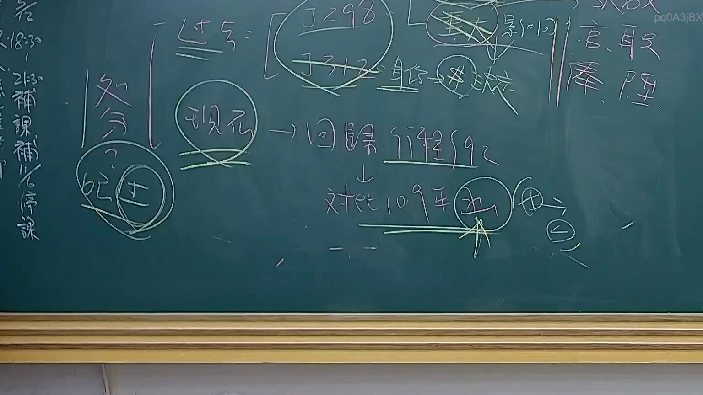

# 🎥 影音教材板書校對筆記
    - **來源影片**: [預約 24 2025-07-31 15-33-47-467](file:///J:/行政法A/ch24/預約 24 2025-07-31 15-33-47-467.mp4)
    - **課程分類**: `[行政法A`
    - **課堂章節**: `ch24]`
    - **影片時間戳記**: `01:11:00` (4260 秒)
    - **板書類型**: `影音板書`
    - **偵測時間**: 2026-07-22 03:44:24
    
    ## 🔍 擷取黑板板書對照圖
    
    
    ## 🧠 AI 智慧理解與知識庫演化註記
    ：
本次板書內容涉及臺灣憲法訴訟與釋字解釋的效力範圍及其時間效力。
1. **核心辨識文字**：
   - 「過去」對應「釋字798、釋字713」以及「重大影響」、「身分/財產」之區分。
   - 「現在」對應「回歸行程92」（應指司法院大法官審理案件法第17條或相關審理程序，或指釋字第792號等相關實務議題）。
   - 「對比109年」及「有利/不利」。
   - 右側出現「言、取、舉、陸、陞」。

2. **法律學理與爭點**：
   - **解釋效力溯及既往原則**：一般而言，大法官解釋具有溯及既往效力，但針對「行政處分」或「已確定判決」，實務上設有例外。板書提及「過去」與「現在」，係在區分釋字解釋對於系爭法律適用之時點問題。
   - **重大影響與程序保障**：板書中「重大影響」與「身分/財產」係指釋字第725號與第791號等解釋中，針對違憲法律效力是否溯及既往的考量標準，特別是在涉及身分關係（如親屬繼承）與財產權保障之權衡。
   - **109年之關鍵性**：109年為我國憲法訴訟法（憲訴法）施行前夕或釋字第790、791號（通姦除罪化）等重要解釋之年份。此處「對比109年」可能是指憲法訴訟法上對於「有利於聲請人」之裁判見解是否有溯及適用的規定（憲法訴訟法第91條至93條）。

3. **法律條文對照**：
   - **司法院大法官審理案件法第17條**（舊法）或 **憲法訴訟法第91-93條**：涉及判決之溯及力與再審制度。
   - **釋字第725號解釋**：建立了法律違憲時，針對個案救濟的具體程序保障機制，並區分了「對聲請人」與「一般案件」的不同法律效力。
    
    ## 📊 可編輯之 Mermaid 關係流程圖
    ```mermaid
    ：
graph TD
    A["過去"] --> B["釋字798、713"]
    B --> C["重大影響判斷"]
    C --> D["身分與財產權區分"]
    E["現在"] --> F["回歸行程92"]
    F --> G["對比109年裁判"]
    G --> H["有利"]
    G --> I["不利"]
    H --> J["溯及效力"]
    I --> K["無溯及效力"]
    ```
    
    ## ✍️ 操作者手動校對修改區
    <!-- 您可以直接修改上方的文字或調整 Mermaid 區塊中的節點，Obsidian 會即時重新渲染 -->
    - [ ] 欄位結構與法律邏輯已校對無誤。
    - **校對筆記**: 
    