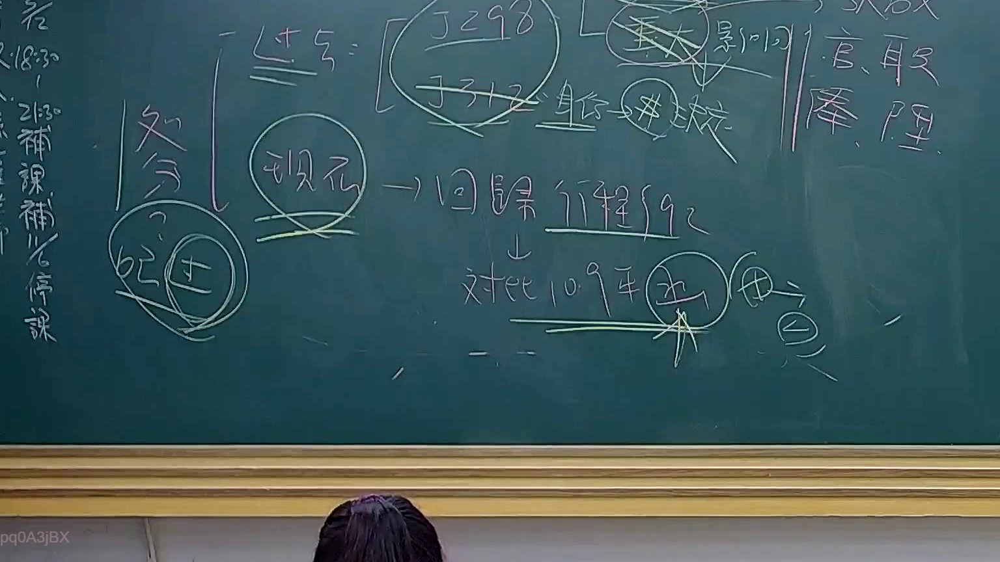

# 🎥 影音教材板書校對筆記
    - **來源影片**: [預約 24 2025-07-31 15-33-47-467](file:///J:/行政法A/ch24/預約 24 2025-07-31 15-33-47-467.mp4)
    - **課程分類**: `[行政法A`
    - **課堂章節**: `ch24]`
    - **影片時間戳記**: `01:20:00` (4800 秒)
    - **板書類型**: `影音板書`
    - **偵測時間**: 2026-07-22 03:44:34
    
    ## 🔍 擷取黑板板書對照圖
    
    
    ## 🧠 AI 智慧理解與知識庫演化註記
    ：
1. 板書文字辨識：
   - 「過去 = [釋字 298, 釋字 312] 身份 --> 隸屬」
   - 「現在 --> 回歸行程 §92」
   - 「對比 109 年 [釋字] --> [行政訴訟]」
   - 「重大影響」、「官、職、俸、陞」
   - 左側文字：「補課、補停課」

2. 法律學理與法條對照：
   - 本板書探討臺灣行政法上「特別權力關係」理論的演變。
   - 「釋字 298、312」代表早期針對公務員等身份，法院採取「特別權力關係」理論，認為其內部管理事項（如降級、免職等）不具備行政處分性質，不得提起行政爭訟。
   - 「現在 --> 回歸行程 §92」：指司法院釋字第 785 號（109年）後，行政程序法第 92 條關於行政處分的定義與救濟門檻產生重大翻轉。對於涉及「重大影響」公務員身分或重大權益事項（如官、職、俸、陞），即便屬於內部管理措施，亦承認其具備處分性質，應回歸行政訴訟體系進行司法審查。
   - 核心邏輯：從「身份隸屬」否定司法審查權，演變為「權利保障」導向的行政爭訟機制。
    
    ## 📊 可編輯之 Mermaid 關係流程圖
    ```mermaid
    ：
graph TD
    A["過去：特別權力關係"] --> B["釋字298、312"]
    B --> C["身份隸屬關係"]
    C --> D["否定行政處分性質"]
    E["現在：權利救濟導向"] --> F["行政程序法第92條"]
    F --> G["重大影響事項"]
    G --> H["官、職、俸、陞"]
    H --> I["回歸行政訴訟救濟"]
    J["109年釋字(785號)"] -.-> E
    ```
    
    ## ✍️ 操作者手動校對修改區
    <!-- 您可以直接修改上方的文字或調整 Mermaid 區塊中的節點，Obsidian 會即時重新渲染 -->
    - [ ] 欄位結構與法律邏輯已校對無誤。
    - **校對筆記**: 
    