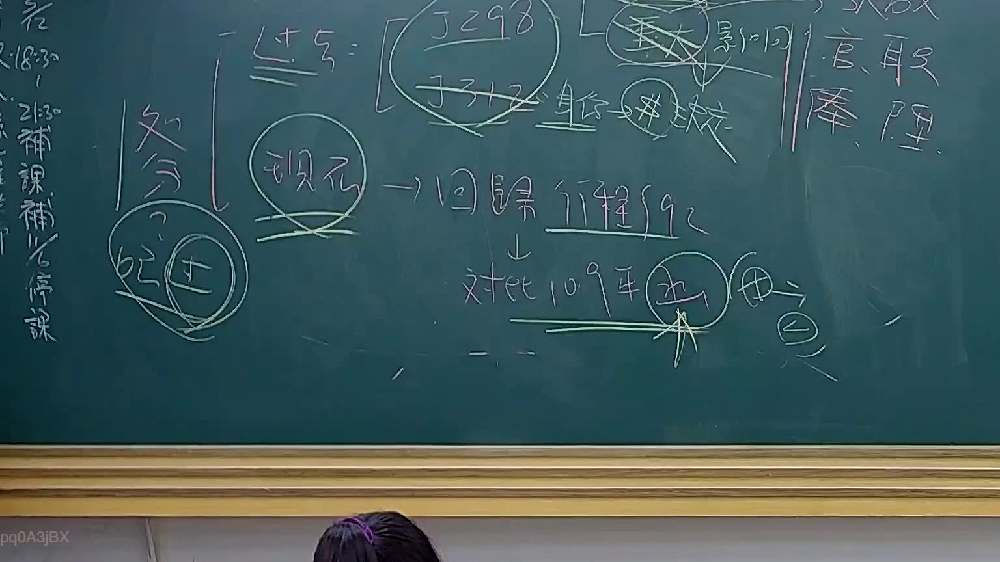

# 🎥 影音教材板書校對筆記
    - **來源影片**: [預約 24 2025-07-31 15-33-47-467](file:///J:/行政法A/ch24/預約 24 2025-07-31 15-33-47-467.mp4)
    - **課程分類**: `[行政法A`
    - **課堂章節**: `ch24]`
    - **影片時間戳記**: `01:22:00` (4920 秒)
    - **板書類型**: `影音板書`
    - **偵測時間**: 2026-07-22 03:44:44
    
    ## 🔍 擷取黑板板書對照圖
    
    
    ## 🧠 AI 智慧理解與知識庫演化註記
    ：
本板書主要討論我國行政法上的「處分」觀念演變，特別是針對「司法院釋字第 298 號」與「釋字第 312 號」之繼受與回歸，以及相關訴訟救濟路徑的探討。

1. 文字內容：
   - 「處分」：行政法核心概念，與行政訴訟標的密切相關。
   - 「釋 298」、「釋 312」：分別涉及公務員懲戒與行政處分之定義與救濟。
   - 「重大影響」、「身份→行政」：指涉公法上法律關係的性質認定。
   - 「現在 → 回歸 行程法 92條」：此處指行政程序法第 92 條關於行政處分的定義，強調實務見解回到行政程序法的法制化標準。
   - 「對比 109 年 決」：應指最高行政法院相關大法庭裁定或判決，確認處分認定之標準。
   - 「官、職、俸、降」：行政處分對於公務員身分權益的具體影響範圍。

2. 法律對照：
   - 行政程序法第 92 條：定義行政處分為「行政機關就公法上具體事件所為之決定或其他公權力措施而對外直接發生法律效果之單方行政行為」。
   - 釋字 298 號與 312 號：在釋字 785 號以前，為公務員權益保障（如考績、懲處）是否構成行政處分的關鍵轉捩點，板書呈現了從過去強調特別權力關係，轉向回歸行政程序法定義，並透過 109 年的實務裁判強化司法審查之範疇。
    
    ## 📊 可編輯之 Mermaid 關係流程圖
    ```mermaid
    ：
graph TD
    A["處分概念"] --> B["釋字 298、312"]
    B --> C["重大影響/身份變動"]
    C --> D["回歸行政程序法第92條"]
    D --> E["109年裁判見解"]
    E --> F["官、職、俸、降之權益保障"]
    F --> G["行政訴訟救濟"]
    ```
    
    ## ✍️ 操作者手動校對修改區
    <!-- 您可以直接修改上方的文字或調整 Mermaid 區塊中的節點，Obsidian 會即時重新渲染 -->
    - [ ] 欄位結構與法律邏輯已校對無誤。
    - **校對筆記**: 
    