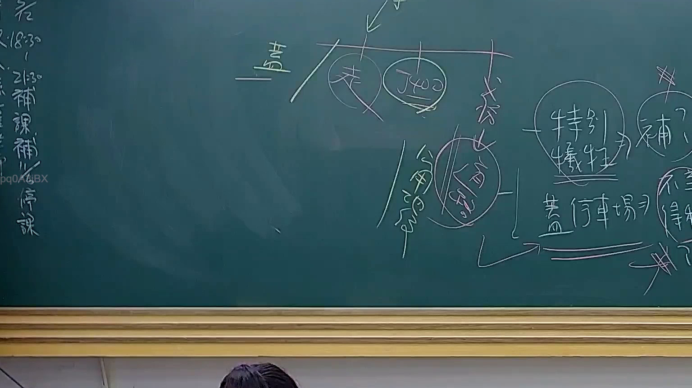

# 🎥 影音教材板書校對筆記
    - **來源影片**: [預約 24 2025-07-31 15-33-47-467](file:///J:/行政法A/ch24/預約 24 2025-07-31 15-33-47-467.mp4)
    - **課程分類**: `[行政法A`
    - **課堂章節**: `ch24]`
    - **影片時間戳記**: `01:48:30` (6510 秒)
    - **板書類型**: `影音板書`
    - **偵測時間**: 2026-07-22 03:44:59
    
    ## 🔍 擷取黑板板書對照圖
    
    
    ## 🧠 AI 智慧理解與知識庫演化註記
    ：
本板書核心探討的是行政法上的「損失補償」概念，特別針對「特別犧牲」理論及其與釋字第400號的關聯。

1. **文字辨識**：
   - 頂部中心結構：蓋（行政處分/措施）→ 產生「特別犧牲」概念，並連結至「釋字400」。
   - 右側內容：特別犧牲 -> 補償。
   - 下方案例：蓋停車場 -> 引起關於公用地役關係或土地徵收補償的爭議（對照釋字400號有關既成道路之規定）。
   - 右下角：不得補償（反思/爭點）。

2. **法理與法律對照**：
   - **特別犧牲理論**：源於德國公法學說，指國家為了公共利益對特定人施加的負擔，若超過了社會大眾應共同忍受的程度，即構成「特別犧牲」，國家必須給予補償。
   - **釋字第400號**：這是臺灣公法學極為重要的判例，探討「既成道路」是否構成公用地役關係。大法官指出，若土地已成為公共通行道路多年，國家應給予補償。板書中將「特別犧牲」與「釋字400」並列，旨在說明財產權受公權力限制時，補償的法理基礎。
   - **連結條文**：
     - **憲法第15條**：財產權保障。
     - **憲法第23條**：法律保留原則及比例原則。
     - **土地徵收條例**：徵收補償之具體規範。
     - **國家賠償法**：區分「合法行為導致損失（補償）」與「違法行為導致損害（賠償）」。

3. **演化邏輯**：
   板書展示了行政行為（蓋）如何透過「特別犧牲」的過濾器，最終導向「補償」的請求權基礎。
    
    ## 📊 可編輯之 Mermaid 關係流程圖
    ```mermaid
    ：
graph TD
    A["行政行為(如蓋停車場)"] -->|造成負擔| B{"特別犧牲"}
    B -->|符合標準| C["釋字第400號法理"]
    C --> D["損失補償請求權"]
    B -->|未達特別犧牲| E["不得補償(社會義務)"]
    ```
    
    ## ✍️ 操作者手動校對修改區
    <!-- 您可以直接修改上方的文字或調整 Mermaid 區塊中的節點，Obsidian 會即時重新渲染 -->
    - [ ] 欄位結構與法律邏輯已校對無誤。
    - **校對筆記**: 
    