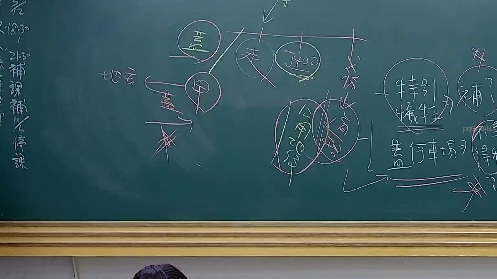

# 🎥 影音教材板書校對筆記
    - **來源影片**: [預約 24 2025-07-31 15-33-47-467](file:///J:/行政法A/ch24/預約 24 2025-07-31 15-33-47-467.mp4)
    - **課程分類**: `[行政法A`
    - **課堂章節**: `ch24]`
    - **影片時間戳記**: `01:54:30` (6870 秒)
    - **板書類型**: `影音板書`
    - **偵測時間**: 2026-07-22 03:45:19
    
    ## 🔍 擷取黑板板書對照圖
    
    
    ## 🧠 AI 智慧理解與知識庫演化註記
    ：
本板書主要討論「公法上損失補償」之法理架構，特別針對行政法中財產權遭受公權力侵害時的補償爭議。

1. **板書內容辨識**：
   - 核心概念：土地、甲、某（或特定主體）、地役（權）、特別犧牲、公用徵收、補償。
   - 結構分析：左側以「甲」為中心，涉及「地役」權利關係；右側則探討「特別犧牲」與「補償」之關係，並以「蓋停車場」作為具體行政行為案例。

2. **法理與法條對照**：
   - **特別犧牲 (Special Sacrifice)**：這是行政法損失補償的核心要件。指國家為公共利益，對特定人合法行使公權力，致其遭受顯著大於一般人之損失，須予以補償。
   - **土地法與徵收條例**：板書中提到的「公用徵收」，對應《土地法》第208條與《土地徵收條例》，強調政府為公共利益取得人民土地需給予「合理補償」。
   - **憲法基礎**：此概念源自《憲法》第15條財產權之保障，並經由《司法院釋字第400號》（板書中明確出現「釋400」）確立公用地役關係之補償法理。
   - **邏輯演化**：板書暗示若行政行為構成「特別犧牲」，則行政主體（政府）負有提供適當補償之義務；若非特別犧牲（如一般社會義務），則不予補償。
    
    ## 📊 可編輯之 Mermaid 關係流程圖
    ```mermaid
    ：
graph TD
    A["行政行為"] --> B["特別犧牲"]
    B --> C{"補償義務"}
    C -->|是| D["依法給予補償"]
    C -->|否| E["無需補償"]
    F["土地"] --> G["公用徵收"]
    G --> B
    H["地役權"] --> I["甲之財產權"]
    I --> B
    J["釋字400號"] -.-> B
    K["蓋停車場案例"] --> G
    ```
    
    ## ✍️ 操作者手動校對修改區
    <!-- 您可以直接修改上方的文字或調整 Mermaid 區塊中的節點，Obsidian 會即時重新渲染 -->
    - [ ] 欄位結構與法律邏輯已校對無誤。
    - **校對筆記**: 
    