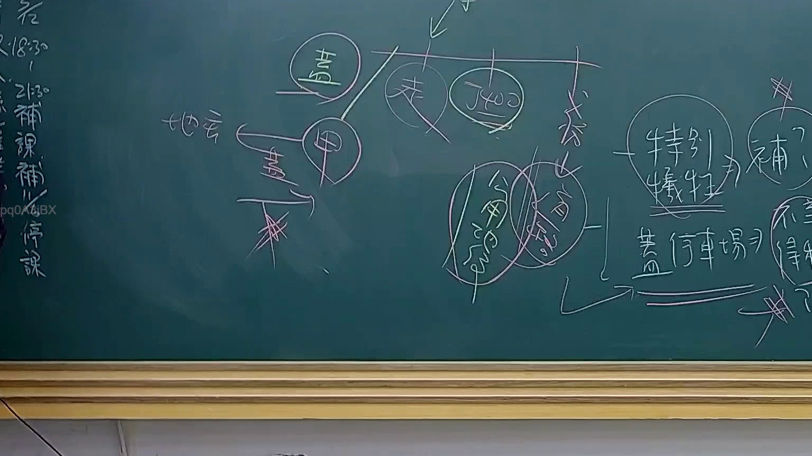

# 🎥 影音教材板書校對筆記
    - **來源影片**: [預約 24 2025-07-31 15-33-47-467](file:///J:/行政法A/ch24/預約 24 2025-07-31 15-33-47-467.mp4)
    - **課程分類**: `[行政法A`
    - **課堂章節**: `ch24]`
    - **影片時間戳記**: `02:00:30` (7230 秒)
    - **板書類型**: `影音板書`
    - **偵測時間**: 2026-07-22 03:45:29
    
    ## 🔍 擷取黑板板書對照圖
    
    
    ## 🧠 AI 智慧理解與知識庫演化註記
    ：
此板書主要探討行政法領域中關於「財產權受損」與「特別犧牲」的補償邏輯，特別是涉及土地徵收或公用限制的法律爭議。

1. **辨識文字重點**：
   - 「地主」、「甲」（可能指代特定個案中的地主）、「特別犧牲」、「補償」。
   - 「公用徵收」、「公用限制」（或公用負擔）。
   - 「蓋停車場」：具體行政行為的標的。

2. **法律學理與法條對照**：
   - **特別犧牲（Special Sacrifice）**：這是補償義務的基礎，源於憲法第15條財產權保障。若國家為了公益目的（如興建停車場）對特定人（地主）施加過度的義務，致使其受到損害，必須給予合理補償。
   - **公用徵收與公用限制**：對照《土地徵收條例》第1條、第30條，徵收須具公益性、必要性並給予「相當之補償」。板書中將「特別犧牲」與「補償」連結，討論在「蓋停車場」等公用事業下，若不給予補償是否違憲。
   - **行政程序法與補償法理**：若屬適法之行政行為（蓋停車場），則涉及「損失補償」（合法行為造成特殊損害）；若非適法則轉為「國家賠償」（國家賠償法第2條）。

3. **邏輯結構**：
   - 核心點在於「公用徵收」與「特別犧牲」的認定。當國家以公共利益（停車場）限制人民權利時，必須通過「特別犧牲」的檢驗，進而導出「補償」的義務，否定單純以公共利益為由的無償剝奪。
    
    ## 📊 可編輯之 Mermaid 關係流程圖
    ```mermaid
    ：
graph TD
    A["公益目的"] --> B["公用徵收 / 限制"]
    B --> C{"是否構成特別犧牲?"}
    C -- 是 --> D["國家必須補償"]
    C -- 否 --> E["一般社會義務/無補償"]
    B --> F["案例 蓋停車場"]
    F --> G["影響對象 地主(甲)"]
    G --> D
    ```
    
    ## ✍️ 操作者手動校對修改區
    <!-- 您可以直接修改上方的文字或調整 Mermaid 區塊中的節點，Obsidian 會即時重新渲染 -->
    - [ ] 欄位結構與法律邏輯已校對無誤。
    - **校對筆記**: 
    