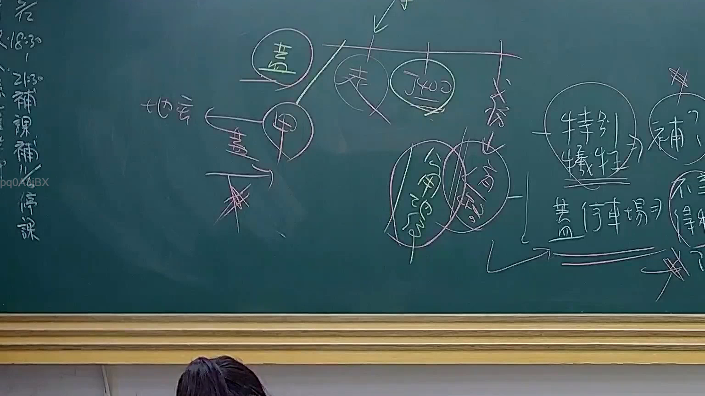

# 🎥 影音教材板書校對筆記
    - **來源影片**: [預約 24 2025-07-31 15-33-47-467](file:///J:/行政法A/ch24/預約 24 2025-07-31 15-33-47-467.mp4)
    - **課程分類**: `[行政法A`
    - **課堂章節**: `ch24]`
    - **影片時間戳記**: `02:02:15` (7335 秒)
    - **板書類型**: `影音板書`
    - **偵測時間**: 2026-07-22 03:45:39
    
    ## 🔍 擷取黑板板書對照圖
    
    
    ## 🧠 AI 智慧理解與知識庫演化註記
    ：
本板書主要討論行政法領域中關於「公用地役關係」與「特別犧牲」之法律爭點，結合司法院大法官釋字第400號解釋之法理。

1. **辨識內容**：
   - 頂部中心結構：涉及地役權與公用地役關係之探討。
   - 關鍵術語：
     - 「地役」（公用地役關係）、「甲」（指涉特定私有土地所有人）。
     - 「特別犧牲」（Special Sacrifice）：指人民財產權受公權力限制超過社會義務之限度。
     - 「補償」（Compensation）：特別犧牲後之救濟手段。
     - 「釋400」（即釋字第400號解釋）：核心法律依據。
     - 「公用限制」與「公用地役關係」。
     - 右側註記：「特別犧牲」、「補償」、「公用停車場」。

2. **法律學理與對照**：
   - **釋字第400號解釋**：這是行政法考點的核心，界定私有土地若具備「既成道路」要件（符合公眾通行、經過長久時間、土地所有權人未阻止），即成立「公用地役關係」，國家不需徵收即可合法使用。
   - **特別犧牲與補償**：雖然釋字第400號承認公用地役關係之合憲性，但強調若對私人財產之限制「逾越社會義務」，則構成特別犧牲，國家應給予適當補償（與憲法第15條財產權保障及第23條比例原則連結）。
   - **實務邏輯**：板書中「補償」與「特別犧牲」的連接，討論的是在公法上要求補償的請求權基礎，通常涉及國家賠償或損失補償。
    
    ## 📊 可編輯之 Mermaid 關係流程圖
    ```mermaid
    ：
graph TD
    A["釋字第400號"] --> B["公用地役關係"]
    B --> C["公用限制"]
    B --> D["特別犧牲"]
    D --> E["補償請求"]
    F["私有土地(甲)"] -->|被認定為| B
    E -->|案例對象| G["公用停車場"]
    D -->|連結| G
    ```
    
    ## ✍️ 操作者手動校對修改區
    <!-- 您可以直接修改上方的文字或調整 Mermaid 區塊中的節點，Obsidian 會即時重新渲染 -->
    - [ ] 欄位結構與法律邏輯已校對無誤。
    - **校對筆記**: 
    