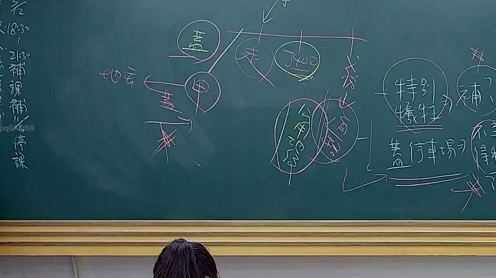

# 🎥 影音教材板書校對筆記
    - **來源影片**: [預約 24 2025-07-31 15-33-47-467](file:///J:/行政法A/ch24/預約 24 2025-07-31 15-33-47-467.mp4)
    - **課程分類**: `[行政法A`
    - **課堂章節**: `ch24]`
    - **影片時間戳記**: `02:03:45` (7425 秒)
    - **板書類型**: `影音板書`
    - **偵測時間**: 2026-07-22 03:45:49
    
    ## 🔍 擷取黑板板書對照圖
    
    
    ## 🧠 AI 智慧理解與知識庫演化註記
    ：
本板書核心探討的是行政法領域中「特別犧牲」與「補償」的相關法律邏輯。

1. **辨識內容**：
   - 左側架構：包含「地主」、「蓋」、「甲」等關係鏈，並有刪除符號，暗示原定土地利用計畫或處分因故被否決或變更。
   - 中間架構：提到「公用地役關係」與「行政處分」。板書中將「公用地役關係」與釋字「釋400」連結，這是臺灣行政法上探討土地遭劃設為既成道路時，人民財產權受損是否構成特別犧牲的經典考題。
   - 右側架構：關鍵詞「特別犧牲」指向「補償？」。這對應到憲法第15條財產權保障，以及司法院釋字第400號解釋意旨。當私人土地因公眾通行而形成「公用地役關係」，若造成土地所有人無法行使所有權，且該負擔已逾越社會責任範疇，即構成「特別犧牲」，國家應給予適當補償。
   - 關於「蓋停車場」與「補」，顯示若土地被劃定為特定公共設施（如停車場），涉及徵收或限制使用之補償問題。

2. **法條對照與邏輯**：
   - **憲法第15條**：財產權保障。
   - **行政法理**：公用地役關係（釋字400號）。當私人土地成為既成道路，若符合「公共利益」、「客觀上無其他適當通路」等要件，政府可對土地所有權進行限制。
   - **特別犧牲（Special Sacrifice）**：當人民遭受非一般義務所能涵蓋的財產損害時，國家基於平等原則，須給予損失補償。這與侵權行為（民法第184條）不同，後者強調「違法性與過失」，而特別犧牲強調的是「合法行為所致之特別損失」。
    
    ## 📊 可編輯之 Mermaid 關係流程圖
    ```mermaid
    ：
graph TD
    A["土地處置與補償"] --> B["特別犧牲"]
    B --> C{"是否給予補償?"}
    C -->|是| D["符合釋字400號精神"]
    C -->|否| E["公用地役關係之社會責任"]
    F["地主"] -->|所有權行使| G["蓋停車場"]
    G --> H["受限"]
    H --> I["行政機關劃定用途"]
    I --> D
    J["公用地役關係"] -.-> D
    ```
    
    ## ✍️ 操作者手動校對修改區
    <!-- 您可以直接修改上方的文字或調整 Mermaid 區塊中的節點，Obsidian 會即時重新渲染 -->
    - [ ] 欄位結構與法律邏輯已校對無誤。
    - **校對筆記**: 
    