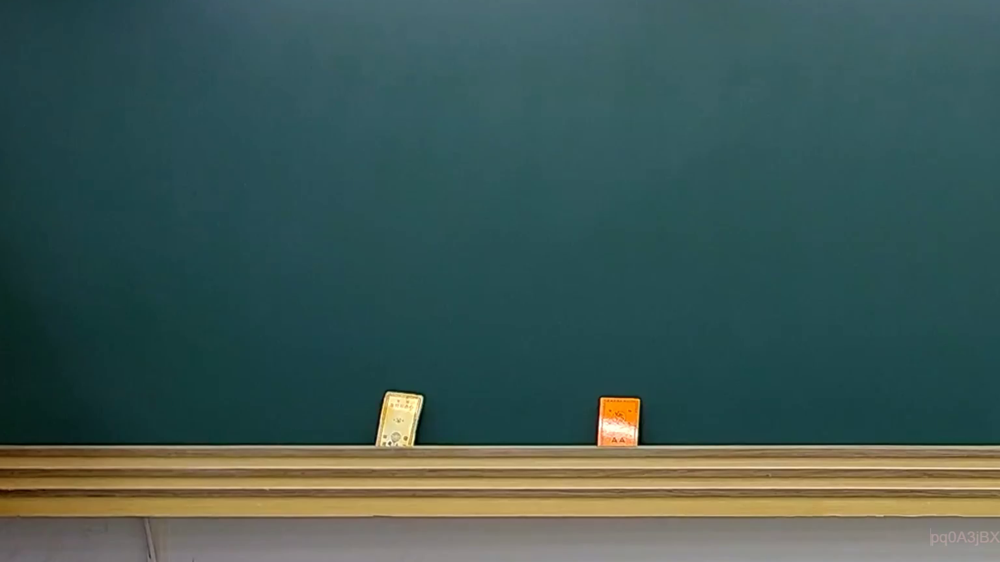

# 🎥 影音教材板書校對筆記
    - **來源影片**: [預約 25 2025-02-10 01-15-06-350](file:///J:///民訴B///ch25///預約 25 2025-02-10 01-15-06-350.mp4)
    - **課程分類**: `[民訴B`
    - **課堂章節**: `ch25]`
    - **影片時間戳記**: `00:00:30` (30 秒)
    - **板書類型**: `影音板書`
    - **偵測時間**: 2026-08-07 20:13:57
    
    ## 🔍 擷取黑板板書對照圖
    
    
    ## 🧠 AI 智慧理解與知識庫演化註記
    ：
經仔細分析圖片，在時間點 0分30秒擷取的板書圖片中，黑板上並無任何文字、符號或圖形書寫。黑板畫面為空白，僅有下方的粉筆槽上放置了兩個板擦。因此，無法進行文字辨識、法律學理闡釋或法條對照。
    
    ## 📊 可編輯之 Mermaid 關係流程圖
    ```mermaid
    ：
無任何可辨識的板書內容以生成Mermaid邏輯圖。
    ```
    
    ## ✍️ 操作者手動校對修改區
    <!-- 您可以直接修改上方的文字或調整 Mermaid 區塊中的節點，Obsidian 會即時重新渲染 -->
    - [ ] 欄位結構與法律邏輯已校對無誤。
    - **校對筆記**: 
    