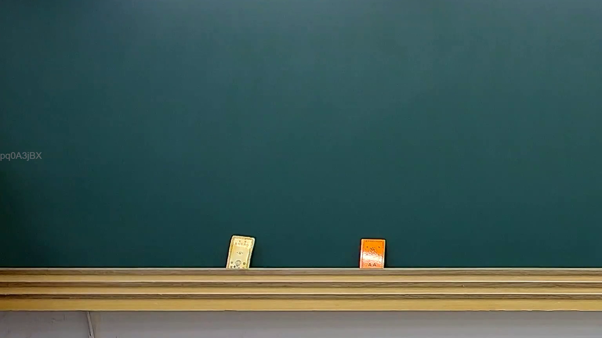

# 🎥 影音教材板書校對筆記
    - **來源影片**: [預約 25 2025-02-10 01-15-06-350](file:///J:///民訴B///ch25///預約 25 2025-02-10 01-15-06-350.mp4)
    - **課程分類**: `[民訴B`
    - **課堂章節**: `ch25]`
    - **影片時間戳記**: `00:01:30` (90 秒)
    - **板書類型**: `影音板書`
    - **偵測時間**: 2026-08-07 20:14:09
    
    ## 🔍 擷取黑板板書對照圖
    
    
    ## 🧠 AI 智慧理解與知識庫演化註記
    ：
經仔細分析您提供的圖片，在影像所示的黑板上並未偵測到任何老師書寫的板書文字、符號或任何圖形。畫面中央僅顯示一塊乾淨的黑板，黑板下方的粉筆槽上放置了兩個小物件，看起來像兩本小書或卡片，但其內容無法辨識。

由於圖片中沒有可供辨識的板書內容，因此無法進行板書高精度 OCR、詳細解讀其法律學理、爭點、案例邏輯或關係，也無法對照相關法律條文進行理解與演化註記。

建議您重新確認所提供的圖片是否為預期中包含板書內容的截圖。若有其他包含板書的圖片，我很樂意為您提供進一步的分析。
    
    ## 📊 可編輯之 Mermaid 關係流程圖
    ```mermaid
    ：
由於圖片中未偵測到任何板書內容或可供建構邏輯關係的結構，因此無法生成 Mermaid.js 關係圖代碼。
    ```
    
    ## ✍️ 操作者手動校對修改區
    <!-- 您可以直接修改上方的文字或調整 Mermaid 區塊中的節點，Obsidian 會即時重新渲染 -->
    - [ ] 欄位結構與法律邏輯已校對無誤。
    - **校對筆記**: 
    